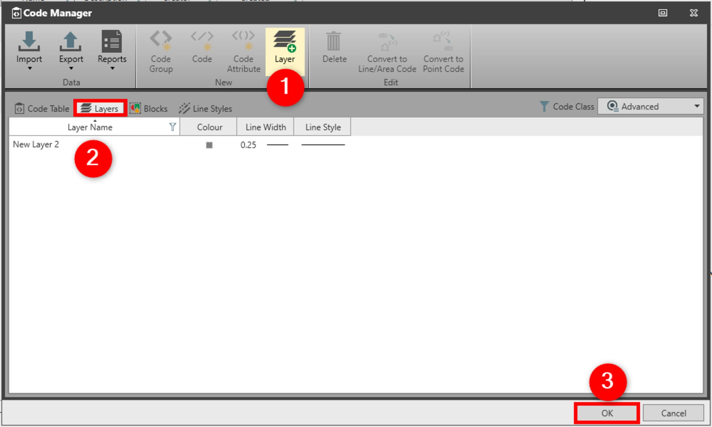

# Layer

### Layer

A layer is used to group thematic information within a project. The layer includes style information that can apply to all the coded features that are using this layer.

Use the style option to decide if the feature is presented with its individual by code style or with the common by layer style.

To add a new layer:

**To add a new layer:**

|  |  |
| --- | --- |

| 1. | In the Code Manager, select Layer from the ribbon bar. |
| --- | --- |
| 2. | The view is switched to the Layers tab and in the content area a new layer is created with default settings that can be modified. |
| 3. | Select OK to save the changes and to close the Code Manager. |

**Layer**

**Layers**

**OK**

See also:

**See also:**

Code Tables

The video "Leica Infinity – Feature Coding Part 1 - How to create a Code Table & Codelist" https://www.youtube.com/watch?v=9Mf8E0trTXA

**"Leica Infinity – Feature Coding Part 1 - How to create a Code Table & Codelist"**

The video "Leica Infinity – Feature Coding Part 2 - How to use blocks and layers" https://www.youtube.com/watch?v=REYP8JzmaSs

**"Leica Infinity – Feature Coding Part 2 - How to use blocks and layers"**

