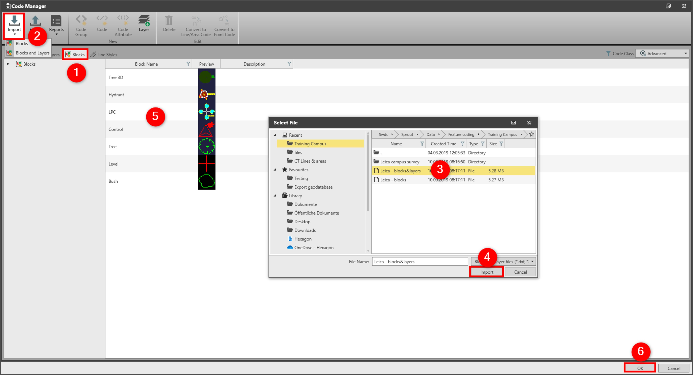

# Layers and Blocks

### Layers and Blocks

Blocks are the collection of geometry objects that act as a single object and can be used in a drawing repetitively to represent features. For example, a block can be used to represents a tree or a signpost.

Blocks can have attributes and can only be used for the codes, type point.

Layers are used to define a common style.

Blocks, block attributes and layers can be imported into the code table from DXF/DWG CAD files.

To import blocks and layers:

**To import blocks and layers:**

|  |  |
| --- | --- |

| 1. | In the Code Manager, select the Layers or the Blocks tab |
| --- | --- |
| 2. | Select Import and then Blocks or Blocks & Layers from the ribbon bar. |
| 3. | Navigate to the file you want to import and select it.A file can have multiple blocks, all are imported as individual blocks in the code manager. |
| 4. | Select Import. |
| 5. | In the content area, the newly imported blocks are seen.The block preview is only shown if it is imported from the CAD file. Blocks preview can be created in AutoCAD with the ‘BLOCKICON’ command. |
| 6. | Select OK to store changes and to close the Code Manager. |

**Layers**

**Blocks**

**Import**

**Blocks**

**Blocks & Layers**

A file can have multiple blocks, all are imported as individual blocks in the code manager.

**Import**

The block preview is only shown if it is imported from the CAD file. Blocks preview can be created in AutoCAD with the ‘BLOCKICON’ command.

**OK**

To see the imported block attributes, select a block in the blocks tab.

To see imported layers, go to the layers tab.

See also:

**See also:**

Code Tables

The video "Leica Infinity - Feature Coding Part 2 - How to use blocks and layers" https://www.youtube.com/watch?v=REYP8JzmaSs

**"Leica Infinity - Feature Coding Part 2 - How to use blocks and layers"**

The video "Leica Infinity - Feature Coding Part 4 - How to process features and export to CAD" https://www.youtube.com/watch?v=ASLoVHHAYGQ

**"Leica Infinity - Feature Coding Part 4 - How to process features and export to CAD"**

