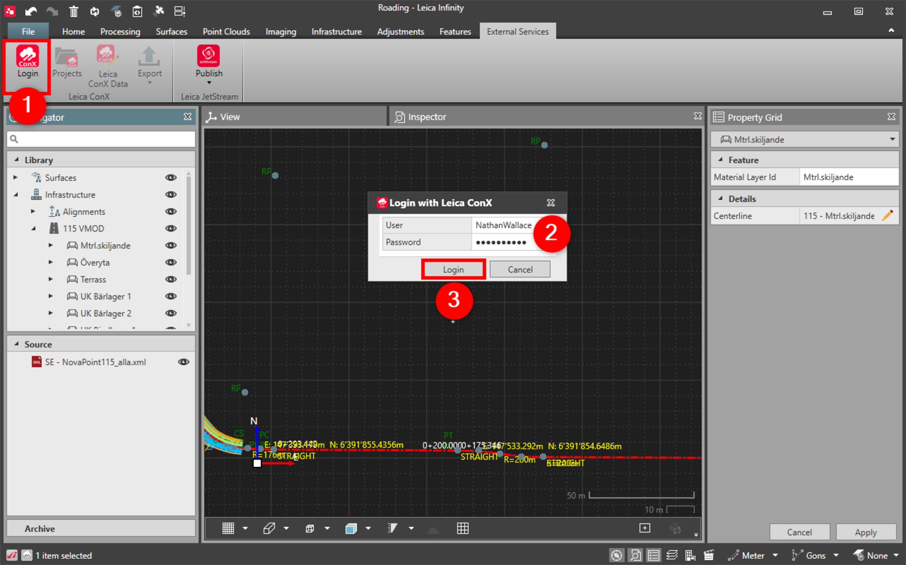
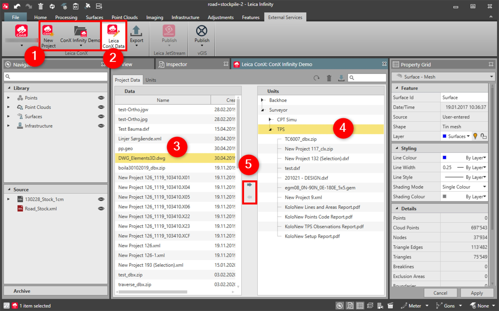

# Leica ConX

### Leica ConX

With the Leica ConX service, you can log in to iCON Build/iCON Site projects and assign data to the project or directly to the units (that are the machines working on building sites).

**Requirements:**

- Valid subscription.

To connect to the service:

**To connect to the service:**

|  |  |
| --- | --- |

| 1. | Select the ConX Login from the External Services tab. |
| --- | --- |
| 2. | Enter the User and the Password.A default user can be set in Leica ConX. |
| 3. | Select Login.The New Project option becomes active. |

**ConX Login**

**External Services**

**User**

**Password**

A default user can be set in Leica ConX.

**Login**

The New Project option becomes active.

To assign/unassign Leica ConX data:

**To assign/unassign Leica ConX data:**

|  |  |
| --- | --- |

| 1. | Create a new project or select one of the available projects.The ConX user ID requires administrator rights to create new projects. |
| --- | --- |
| 2. | Select Leica ConX Data to open the Leica ConX project viewer. |
| 3. | Select the project data you want to assign or the units you want to reassign. |
| 4. | Select the unit to which you want to assign. |
| 5. | Select assign or reassign. |

The ConX user ID requires administrator rights to create new projects.

**Leica ConX Data**

**assign**

**reassign**

See also:

**See also:**

Leica ConX

Export to Leica ConX

