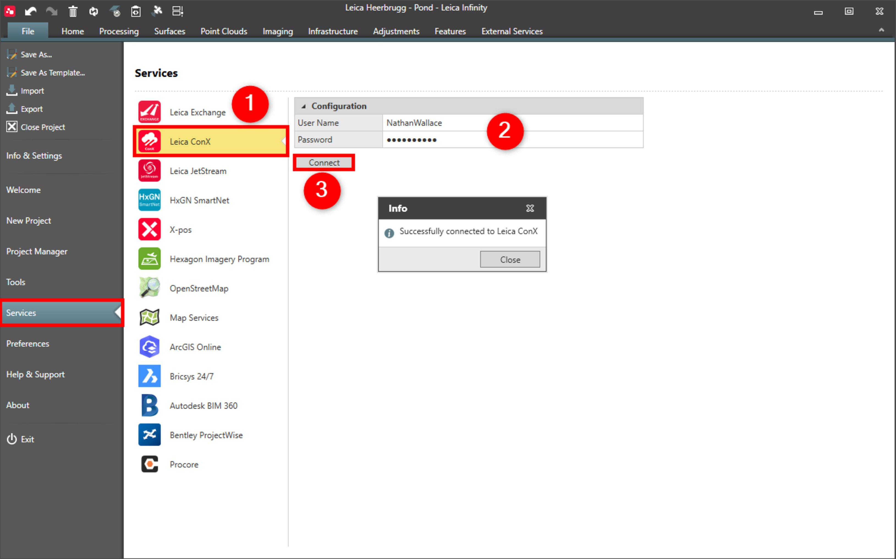

# Leica ConX

### Leica ConX

Infinity supports the Leica ConX service. With the Leica ConX service, you can log in to iCON Build/iCON Site projects and assign data to the project or directly to the units, that are the machines working on building sites.

**Requirements:**

- Valid subscription.

To connect to the Leica ConX service:

**To connect to the Leica ConX service:**

|  |  |
| --- | --- |

| 1. | Select File, then Services and then Leica ConX from the menu. |
| --- | --- |
| 2. | Enter your User Name and Password.You can enter a default user name and password. If you do so, the user name and the password are automatically populated when you select login from within the external services module. |
| 3. | Select Connect.You are connected until you log out from within the external services module. |

**File**

**Services**

**Leica ConX**

**User Name**

**Password**

You can enter a default user name and password. If you do so, the user name and the password are automatically populated when you select login from within the external services module.

**Connect**

You are connected until you log out from within the external services module.

See also:

**See also:**

Leica ConX

Export to Leica ConX

