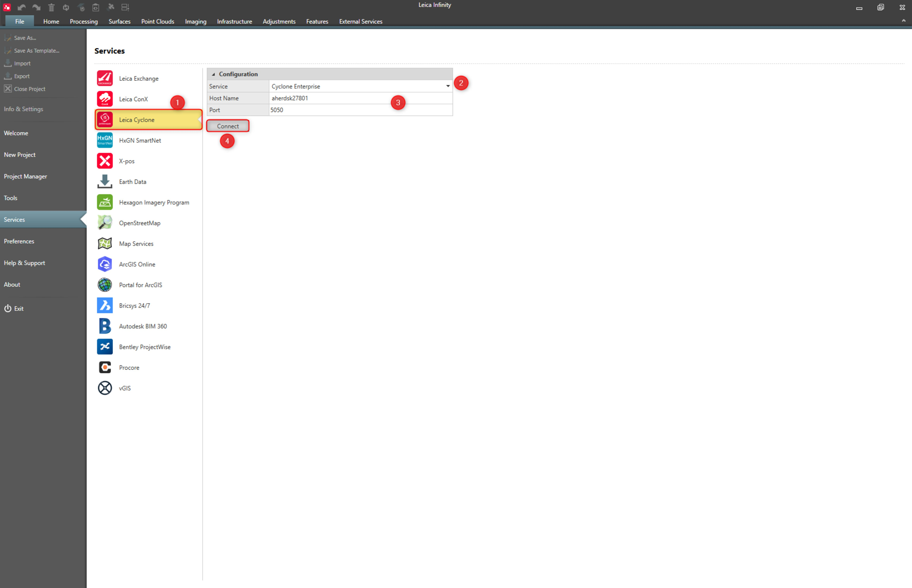

# Leica Cyclone

### Leica Cyclone

Infinity supports the Leica JetStream and the Leica Cyclone Enterprise services.

You can publish point clouds to existing storage locations.

**Requirements:**

- Cyclone Publisher or Cyclone Publisher Pro (from Infinity 3.4.2) (prior to 2023).
- Cyclone WORKFLOW (2023 or newer).

To connect to the Leica JetStream or Leica Cyclone Enterprise service:

**To connect to the Leica JetStream or Leica Cyclone Enterprise service:**

|  |  |
| --- | --- |

| 1. | Select File, then Services and then Leica Cyclone from the menu. |
| --- | --- |
| 2. | Select the Service form the drop-down list:JetStreamCyclone Enterprise |
| 3. | Define the host name and the port. |
| 4. | Select Connect. |

**File**

**Services**

**Leica Cyclone**

- **JetStream**
- **Cyclone Enterprise**

**Connect**

See also:

**See also:**

Publish to Leica Cyclone

https://leica-geosystems.com/products/laser-scanners/software/leica-cyclone/leica-cyclone-enterprise

