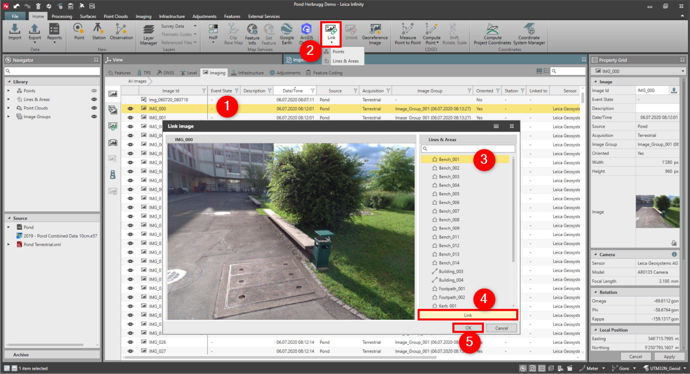

# Link Images

### Link Images

Images can manually be linked to points or lines or areas. They cannot be manually linked to point clouds.

To link images to an object:

**To link images to an object:**

|  |  |
| --- | --- |

| 1. | Select the image you want to link, either from the Inspector, Navigator or the graphical view. |
| --- | --- |
| 2. | Select Link from the Images ribbon bar.Alternatively select Link from the context menu. |
| 3. | In the Link Image window, select the object to which you want to link the images.You can also search for an object. |
| 4. | Select Link to link the image. |
| 5. | Select OK. |

**Link**

**Link**

You can also search for an object.

**Link**

**OK**

An image can be linked to more than one object and an object can have more than one image linked to it.

