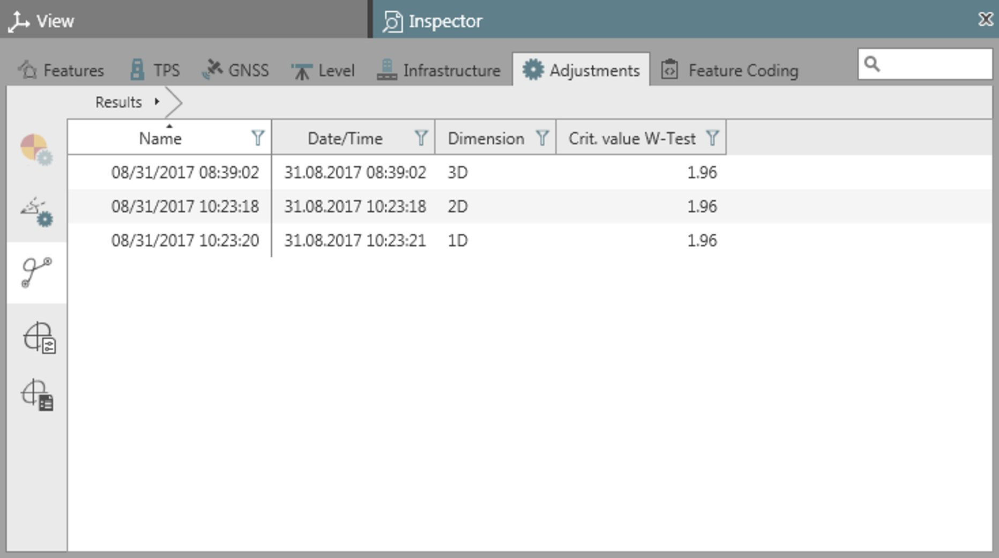
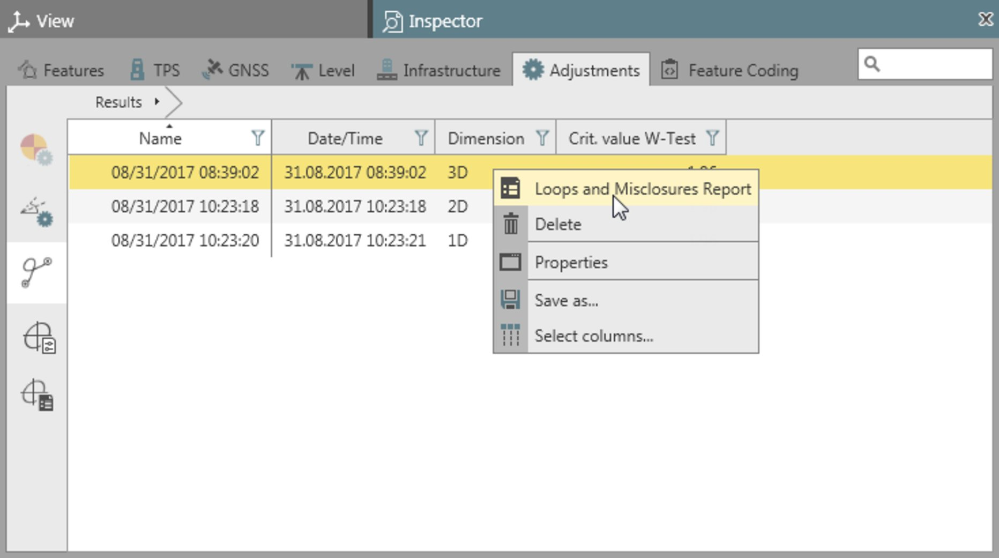

# Loops Computation

### Loops Computation

The compute loops functionality is one of the pre-analysis tools included in the adjustment module. It is used for automatic computation of network loops and loop misclosures.

A loops computation is always applied to the unadjusted network as a means of checking observations before running the adjustment. It detects all loops with a minimum number of sides (triangles).

Loops that could be formed by combining different types are not considered.

As concerns loop type definitions, see the following:

**As concerns loop type definitions, see the following:**

Loop Types

**Loop Types**

| Loop Type | Description |
| --- | --- |
| GNSS Loops | The three sums of all coordinate differences DX, DY and DZ yield closing errors in X, Y and Z. |
| Direction and Distance Loops | The sum of the angles in the loop should be a multiple of 200 gon or 180 deg. The remainder is the angular closing error. The closing errors in X (local Easting) and Y (local Northing) are computed in a local XY system, with the positive Y axis being parallel to the first side of the loop, and the X axis being perpendicular to it.If the two directions of one angle in a loop are not from the same setup, then the angular closing error cannot be computed. The closing errors in X and Y however can still be computed by starting at the point with the missing angle. If two or more angles are missing no closing errors can be computed. |
| Zenith Angle and Distance Loops | The sum of the derived trigonometric height differences also yields a closing error in height. |
| Height Difference Loops | The sum of all height differences equals the closing error in height. |

If the two directions of one angle in a loop are not from the same setup, then the angular closing error cannot be computed. The closing errors in X and Y however can still be computed by starting at the point with the missing angle. If two or more angles are missing no closing errors can be computed.

The calculated closing errors are tested using the W-Test.

The routine does not use approximate and/or known coordinates, and it does not necessarily take into account all observations.

Instrument heights, scale factors and vertical refraction coefficients are accounted for.

The results do not point to a specific observation that could possibly be a blunder.

Compute Loops

**Compute Loops**

To run a loops computation:

**To run a loops computation:**

Select    Compute Loops from the Adjustments tab.

**Compute Loops**

Select from the drop-down menu whether you want to compute 3D (Position and height), 2D (position only) or 1D (height only) loops. By default, loops are computed according to the main adjustment settings.

**3D**

**2D**

**1D**

Only when set to 3D are all loop types considered in the computation.

2D only considers GNSS Baseline loops and Direction and Distance loops.

1D only considers Zenith Angle and Distance loops and Height Difference loops.

Computation results are available under    Computed Loops Results in the Adjustments tab of the Inspector.

**Computed Loops Results**

|  |  |
| --- | --- |

The results of all loop computations are kept in the list until you select them and delete them. To delete a result from the list right-click upon it and select    Delete from the context menu.

**Delete**

Loops and Misclosures Reports

**Loops and Misclosures Reports**

In order to inspect results in detail select a computation run and select Loops and Misclosures Report from the context menu.

**Loops and Misclosures Report**

|  |  |
| --- | --- |

### Loops and Misclosures Report

You can generate a report for each result listed in the Inspector in order to inspect misclosure details. Loops and closing errors are listed by loop type as described in Loops Computation.

The inspector itself does not allow for any drilling-in to results of loop computations.

To generate a loops and misclosures report:

**To generate a loops and misclosures report:**

| 1. | Select a computation result in the Inspector. |
| --- | --- |
| 2. | Select    Reports from the Adjustment ribbon bar and select Loops and Misclosures Report from the drop-down menu.Or:Right-click and select Loops and Misclosures Report from the context menu. |

**Reports**

**Loops and Misclosures Report**

**Loops and Misclosures Report**

The report opens up in a separate window and can be saved as a PDF or HTML file. Both types of file are added to the navigator under Archive > Reports and can be opened from there again.

**Archive**

**Reports**

