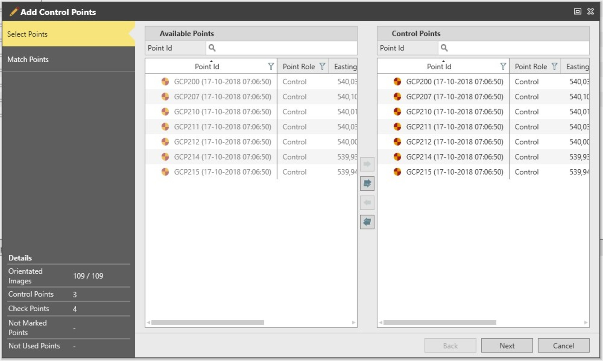
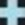
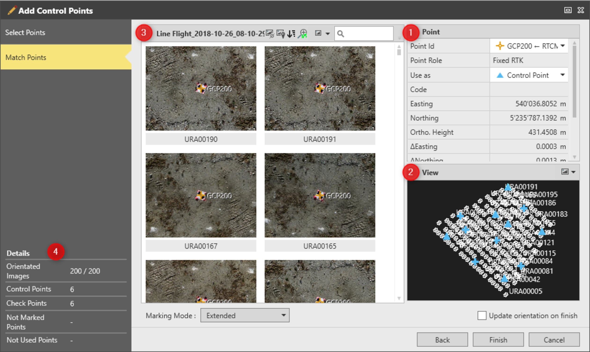
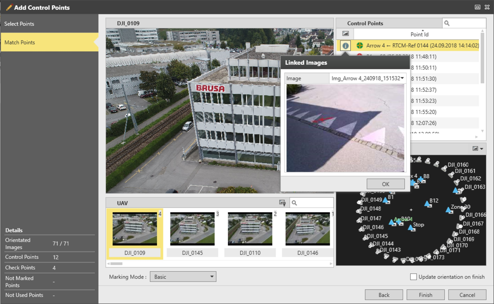
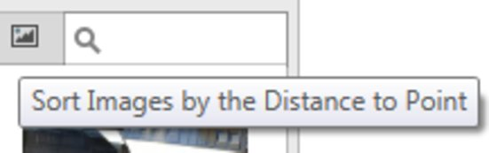
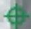

# Marking of Control Points

### Marking of Control Points

Infinity supports the use of control points and check points. You can mark them either before running an orientation task or after storing it.

To mark control points, select the image group and select Add Control Points from the Imaging ribbon bar or from the context menu.

**Add Control Points**

**Imaging**

This action starts the Mark Control Points wizard:

**This action starts the Mark Control Points wizard:**

|  |  |
| --- | --- |

Select Points

**Select Points**

In this window, you select the points that you would like to mark on the images. Any point from your project (imported or calculated) can be added as control point, as long as it has a 3D position.

| 1. | Select the points you want from the Available Points list, move them to the Control Points list. |
| --- | --- |
| 2. | Select Next to proceed to the second page of the wizard. |

**Next**

Match Points

**Match Points**

Infinity offers two ways to mark and match control points:

- Basic Marking Mode: Used to mark multiple control points on one image. It is the default mode when there is no orientation result stored.
- Extended Marking Mode: Used to speed up the marking of a selected control point on multiple images. It is the default mode when there is an orientation result stored.

General Description

**General Description**

The main components of both marking modes are:

**The main components of both marking modes are:**

| No. | Group Name | Description |
| --- | --- | --- |
| 1. | Point List | The place to select which point to mark. |
| 2. | Map View | Shows the images and the control points that have been added in the list. It helps checking the distribution of marked points. You can use the map view option to hide or show the images. If the image group is already oriented, you can also restrict the images that are shown to those that the selected point can be reprojected on. Once a point has been marked, it is displayed in the map view with one of the following icons:   If it is used as a control point.   If it is used as a check point.   If it is not used at all. |
| 3. | Marking Pane | Where the points are marked on the images. The two marking modes use this pane in a different way, refer to the following. |
| 4. | Wizard Navigator | Shows details about:The total number of orientated images/the total number of images in the image group.The total number of control points.The total number of check points.Which points have not been marked.Which points are not used. |
| Basic marking mode layout: | Extended marking mode layout: |

**Point List**

**Map View**

**Marking Pane**

**Wizard Navigator**

- The total number of orientated images/the total number of images in the image group.
- The total number of control points.
- The total number of check points.
- Which points have not been marked.
- Which points are not used.

The Warning section provides information on possible weaknesses of the marking procedure, such as points marked on one image only or if not enough control points are used.

The points that have been added in the point list can be used as control points or check points. This option is available in the Use as column/property in both marking modes.

The basic marking mode:

**The basic marking mode:**

Apart from the common components that were described above, the page also comprises a thumbnail list of the images that belong to the selected image group.

The marking window shows the image that is active for control point marking.

The list of control points includes all the points that can be marked.

To mark a control point:

**To mark a control point:**

| 1. | Select the control point from the list or the map view. |
| --- | --- |
| 2. | Select the image you want to mark this control point on from the image thumbnail list or the map view.The selected image appears in the marking window. |
| 3. | Mark the point on the image. |

If another point is found on the selected image and must be marked, navigate to the position on the image and use the context menu to select the point.

If there are images that have been linked to the control points, they are available in the flyout:

**If there are images that have been linked to the control points, they are available in the flyout:**

|  |  |
| --- | --- |

To speed up the point marking phase, Infinity can sort the image thumbnail list by the incrementing 2D distance of each image to the selected point. This increases the probability that the selected point appears in the first images of the list. To activate this sorting, select Sort Images by the Distance to Point. The same option is available in the Extended Marking Mode.

**Sort Images by the Distance to Point**

|  | To activate this sorting, select Sort Images by the Distance to Point.To sort the images by name, select the same option again. |
| --- | --- |

**Sort Images by the Distance to Point**

The extended marking mode:

**The extended marking mode:**

In this point-based view, multiple images with marking suggestions are displayed for a selected point.

To mark a control point:

**To mark a control point:**

| 1. | Select the control point from the list or the map view. |
| --- | --- |
| 2. | Mark the point on the image. |

If there are images that have been linked to the control points, they are displayed at the bottom of the pane.

The marking pane includes a set of options to:

**The marking pane includes a set of options to:**

- Show only images a selected point can be reprojected on (valid only if an orientation has already been stored for the selected image group).
- Sort images by distance to point or by name (the same option is available in the basic marking mode).
- Sort images by ascending/descending reprojection error (valid only if an orientation has already been stored for the selected image group).
- Zoom in/out in all images using the same zoom factor (can be activated/deactivated).
- Show images in small, medium or large size.
- Search for a specific image.

The context menu that is available in the marking image offers shortcuts that can speed up the marking process.

If a point is already marked on an image, place the mouse over the point marking and use the context menu to: remove, use as check/control point or do not use the specific point.

If an orientation is already stored, the control points and the check points that have at least one out-of-tolerance value are indicated with the    icon.

You can switch between the basic and the extended marking mode at any time: the markings and the settings are saved when switching from one mode to the other.

To close the wizard and store the markings, select Finish.

**Finish**

If you want to change the control points, for example:

**If you want to change the control points, for example:**

- Add or remove control points.
- Improve markings.
- Disable control points.
- Change control points to check points.

You can start the wizard at any time.

If the images are already oriented, the selected point is automatically detected on the selected image. But this marking is not used for updating the image orientation, unless it is confirmed. The suggested marking is displayed with   .

When possible, the use of control points acquired at different heights is recommended in order to improve the orientation step.

