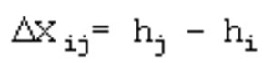
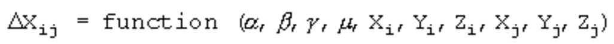

# Mathematical Model

### Mathematical Model

Usually in a survey, the observations themselves are not the quantities, which we are aiming for. Instead, we use the observations to determine unknown parameters, for example the coordinates of stations in a network. The observations are expressed as a function of the parameters in a so-called functional or mathematical model.

In some cases, the model representing the relations between the observations and the unknown parameters is simple. The relation, for example, in a one-dimensional leveling problem between the observed height differences and the unknown heights is linear:

More complicated is the case for a GPS network where the unknowns are coordinates (X,Y,Z) to be determined in a reference system different from that of the observed baselines ΔX:

With α,β,γ,μ = transformation parameters

As the least squares approach requires linear equations, the complex model above must be linearised. Usually this means that a number of iterations are needed to reach a solution. Moreover, approximate values for the coordinate unknowns in the adjustment are required. Bad approximate values can lead to an increasing number of iterations or, in the worst case, to no convergence at all.

Nuisance parameters

**Nuisance parameters**

Since coordinates are our main concern, other unknowns in the mathematical model are not always useful for us. Unknowns such as the transformation parameters mentioned above, are called additional or nuisance parameters. Typical nuisance parameters are: transformation parameters, scale factors, azimuth offsets, orientation unknowns and refraction coefficients. Some of these parameters can be kept fixed at a certain value, which makes them not be corrected in the adjustment. Whether or not to keep parameters fixed is a question which cannot easily be answered. We must always be careful to avoid over constraining as well as not to over parameterise. The introduction of refraction coefficients, for example, could result in the absorption of systematic effects which are not caused by refraction. However, ignoring the refraction, when in fact it does have an influence on the measurements, causes an equally unfavourable effect. The success of what could be referred to as tuning of the model depends largely on the expertise.

Another typical nuisance parameter is the scale factor which may be estimated for distance measurements. The aim of introducing a free scale factor in the adjustment is to overcome a possible bias in the internal scale of the measurement equipment and, in more general terms, to prevent the over constraining of the network in a free adjustment. A free scale factor shrinks or blows up the network in order to make it fit to the known stations in constrained adjustments. As a result, in some situations a free scale factor may obstruct the statistical testing of known stations: An outlier in the coordinates of a known station could remain undetected when, due to the shrink or blow up effect, the network is forced to fit to the known stations without any rejections. The outlier is absorbed by the scale factor, which then has a value distinctly different from 1.0. It is, therefore, recommended to examine the value of the scale factor after the adjustment and, in case of doubt, to rerun the adjustment with a fixed scale.

Singularity

**Singularity**

An adjustment fails when the mathematical model, as represented by the design matrix and normal matrix, is singular.

Singularity is caused by:

**Singularity is caused by:**

- An ill-posed problem.
- An improperly formulated model.

A problem may be ill-posed because we expect too much from the observations, or because not enough observations are included. An example of an ill-posed problem is the determination of the 2D coordinates of an unknown station by a single horizontal direction from another station.

A model is improperly formulated, when too many parameters are included. In general, an improperly formulated model does not correctly represent the existing physical reality.

Additionally, the ill-conditioning of the normal matrix N could result in singularity, a problem which occurs especially with computerised solutions to least squares problems. An ill-conditioned matrix can become singular as a result of the internal accuracy limits of the computer hardware. An example of an ill-conditioned problem is the intersection of a station by two or more nearly parallel directions.

Minimum number of constraints

**Minimum number of constraints**

Apart from the problems mentioned above, an adjustment of terrestrial observations cannot be solved unless the location, orientation and scale of the network are established, that is, a datum must be defined. This is done by imposing constraints on the solution. The minimum number of constraints depends on the dimension of the network:

In a 3D network, there are three translations, three rotations and one scale factor. The singularity is then eliminated by fixing at least seven coordinates of three stations (Lat1, Lon1, h1, Lat2, Lon2, h2, h3).

