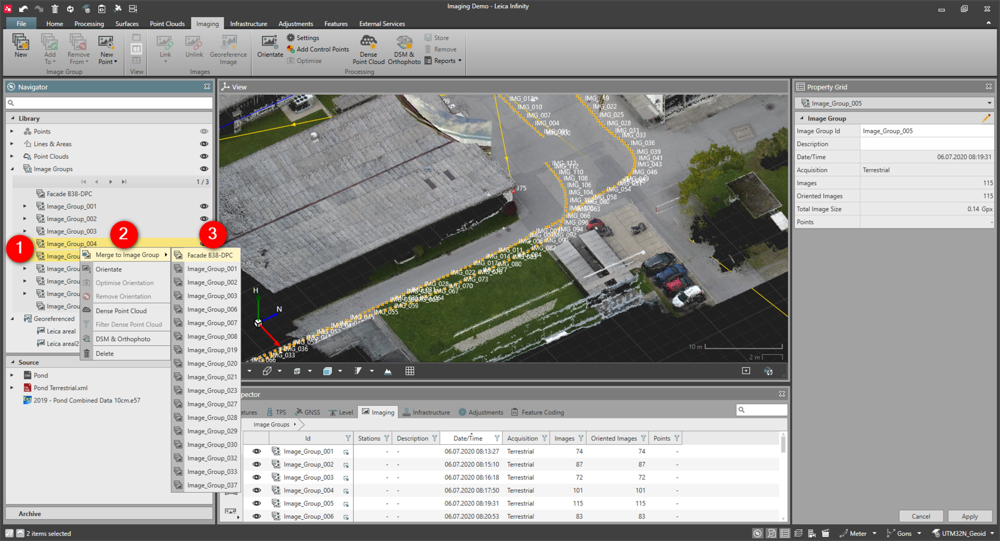

# Merge to Image Group

### Merge to Image Group

It is possible to merge multiple image groups by using the merge to image group function.

To merge to image groups:

**To merge to image groups:**

|  |  |
| --- | --- |

| 1. | From the Navigator or the Inspector, select the Image Groups that should be combined into another Image Group. |
| --- | --- |
| 2. | Select Merge to Image Groups from the context menu. |
| 3. | Select the Image Group to which it should be merged. |

**Merge to Image Groups**

It is only possible to merge image groups when the images have the same camera properties and the same acquisition type.

