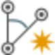

# New Observation

### New Observation

In Infinity you can create stations manually. When you define observations on a manually created station, the station becomes a setup with the orientation unknown.

Creating observations on a new, manually entered station:

**Creating observations on a new, manually entered station:**

| 1. | Select    New observation from the Home tab or the Processing tab. |
| --- | --- |
| 2. | New observations have to be defined in the Property Grid: Enter an ID for the new point that is to be defined by the New Observation. |
| 3. | Select the station ID from which the New Observation aims at the new point. Select the    option on the right to search for and select a station from the fly-out list. |
| 4. | Enter the observation details: Horizontal angle (Hz raw), Vertical angle (V), Slope Distance (SD) as well as the target height and type.Optionally, you can also enter offsets, if necessary, atmospheric and geometric corrections (ppm values) and codes. |
| 5. | Select Create to create the observation. |
| 6. | Repeat steps 1 to 5 until you have entered all observations for a station. |

**New observation**

Optionally, you can also enter offsets, if necessary, atmospheric and geometric corrections (ppm values) and codes.

**Create**

Results:

**Results:**

You see that:

**You see that:**

- With creating the first observation on a newly defined station, its point role changes to be a TPS setup with a still unknown orientation.

The new, manually created setup is added to:

**The new, manually created setup is added to:**

- The navigator as    manually entered in the source section.
- The inspector as a    setup in the TPS tab.

