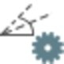

# Observation Properties

### Observation Properties

In the property grid you can change the properties for single observations.

You can:

**You can:**

| 1. | Edit the Target Point ID. |
| --- | --- |
| 2. | Select the    option and select a different Station ID. |
| 3. | Edit the Target Height and select a different Target Type. |
| 4. | Edit the Target Offsets. |
| 5. | Select the    option to re-calculate the Atmospheric and/or Geometric PPM. |
| 6. | Select a different Target Point Code from the drop-down list. |
| 7. | Set how the Local Position Quality shall be defined (choose between Standard Deviations and Coordinate Quality). |

**Target Point ID**

**Station ID**

**Target Height**

**Target Type**

**Target Offsets**

**Atmospheric**

**Geometric PPM**

**Target Point Code**

**Standard Deviations**

**Coordinate Quality**

To re-calculate a setup with another orientation method and using different setup observations make use of the edit setup wizard. To invoke the wizard from inside the Property Grid select the    Open Setup Wizard option in the Orientation section.

**Open Setup Wizard**

Multi-edit

**Multi-edit**

To edit the properties for one or more observations:

**To edit the properties for one or more observations:**

| 1. | Select the observations to be edited either from inside the Source section of the Navigator or from inside the TPS tab or the Adjustments tab of the Inspector.In the TPS tab of the Inspector drill into Setups by selecting the little arrow   . Drill further into a Station to see all connected observations and select the observations to be edited.In the Adjustments tab of the Inspector go to the    Observations section and select the observations to be edited. |
| --- | --- |
| 2. | Right-click into the selection and select the    Edit operation you want to perform from the context menu. |

**Setups**

**Station**

**Observations**

**Edit**

You can select more than one observation at a time. The edit operation is executed for all selected observations/target points.

