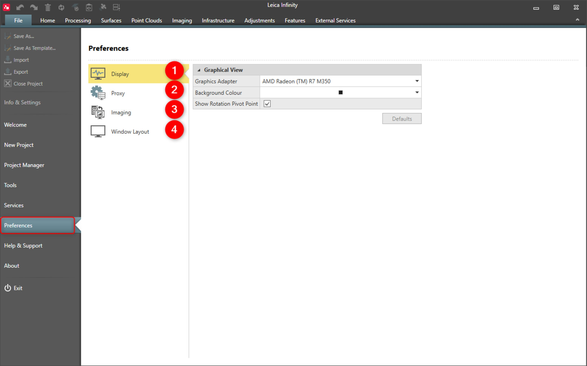

# Overview

### Preferences

Under preferences you can configure global application settings which apply to all projects.

|  |  |
| --- | --- |

| No. | Name | Description |
| --- | --- | --- |
| 1. | Display | Configure the graphical view. |
| 2. | Proxy | Define the proxy server. |
| 3. | Imaging | Define the host for imaging tasks. |
| 4. | Window Layout | Reset window layout to default position. |

**Window Layout**

