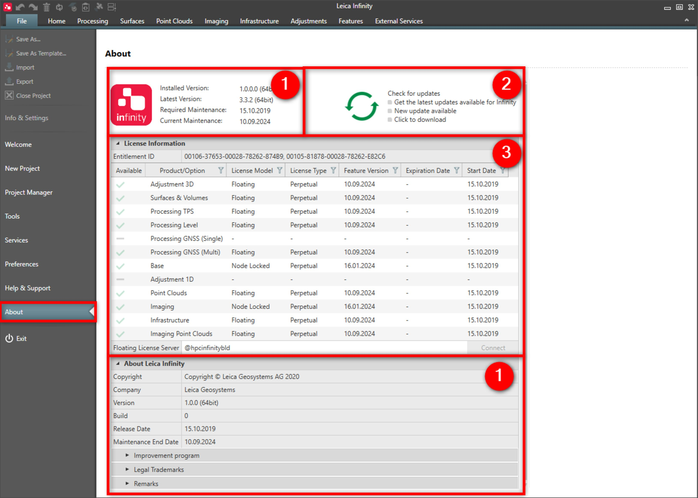

# Overview

### About

In about you get information on:

**In about you get information on:**

|  |  |
| --- | --- |

| No. | Name | Description |
| --- | --- | --- |
| 1. | About Leica Infinity | Check your Infinity version as well as the maintenance information. |
| 2. | Check for Updates | Check for the latest updates available for Infinity. |
| 3. | Licence Information | The purchased product options are listed together with your licence model. |

**About Leica Infinity**

Under the Improvement program, you are asked to contribute towards the improvement of the quality and performance of Infinity.

Leica Geosystems AG collects anonymous information about hardware configuration and application usage.

Under Legal Trademarks, you are informed that and how Leica Infinity is protected by copyright.

Under Remarks, you are informed on the legal and licensing notices on third party software components that Infinity uses.

