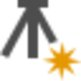
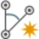
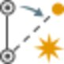
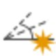

# Overview

### TPS-Processing

The processing module allows you to:

**The processing module allows you to:**

|  | Create new Points. New points can also be created in the home module. |
| --- | --- |
|  | Create a new Station on any point in your project. New stations can also be created in the Home module.Stations for which new observations have been entered, are identified as setups in the TPS tab of the Inspector. |
|  | Create new Observations on any station in your project. New observations can also be created in the Home module. |
|  | Create new Traverses. Only setups can serve as points in a traverse. |
|  | Create new Sets of Angles on any setup in the project. |

**new Points**

**new Station**

**TPS**

**new Observations**

**new Traverses**

**new Sets of Angles**

You can also:

**You can also:**

- Edit setups, see Edit Setup Wizard.
- Edit traverses, see Traverse Wizard.
- Edit sets of angles, see Sets of Angles Wizard.

From inside the TPS tab in the Inspector.

**TPS**

