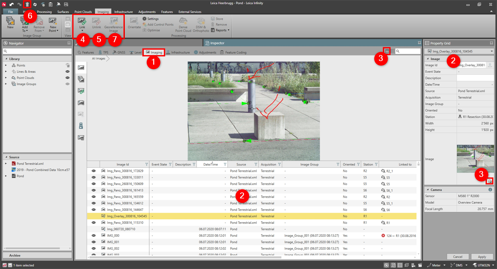

# Overview

### Images

Within images, you get access to the basic functionality of imaging.

**Requirements:**

- Basic option.

Here you can do the following:

**Here you can do the following:**

|  |  |
| --- | --- |

| No. | Name | Description |
| --- | --- | --- |
| 1. | Import Images | Import image data. |
| 2. | Imaging Inspector | Explore imaging-specific project content grouped thematically for detailed investigation. |
| 3. | Image Properties | View the properties of the selected image. |
| 4. | Image Viewer | View the selected image in the image viewer. |
| 5. | Link Images | Link selected image to point/line/area. |
| 6. | Unlink Images | Unlink selected image from point/line/area. |
| 7. | Delete Images | Delete selected images. |
| 8. | Georeference Images | Georeference selected images. |

See also:

**See also:**

The video "Leica Infinity - Home Module - Georeferencing Images" https://www.youtube.com/watch?v=m-U29-ipJgs

**"Leica Infinity - Home Module - Georeferencing Images"**

