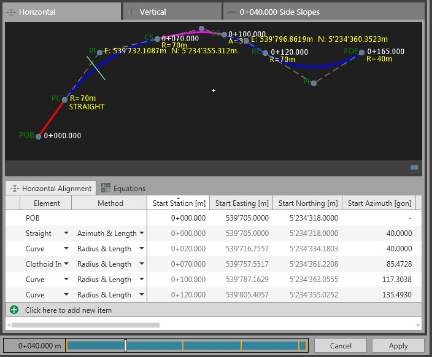

# Overview

### Infrastructure Tool - Roads and Alignments

The infrastructure tool is the dedicated tool to view, create and edit the individual components of an alignment or a road object.

It opens up automatically when you create a new alignment or when you choose to add a new cross section template.

To edit existing elements it can also be invoked from the navigator or the inspector by selecting    Edit from the context menu.

**Edit**

By default the infrastructure tool opens up as a new tab next to the inspector.

|  |  |
| --- | --- |

The chainage bar represents the whole horizontal alignment from its start to the end. The bars show you where cross sections are assigned.

- When the numbering of nodes is different between cross sections, then these areas of the alignment are transition areas and marked as such in the chainage bar.
- When cross section assignments are missing or there are gaps in the road, then these areas are without any marking.

You can shift the slider to any position in the road or enter a chainage value to make the slider jump. Both Alignment views (horizontal and vertical) as well as the cross section view follow your movements.

On the bars, the cross section view, show you the details of assigned cross sections.

