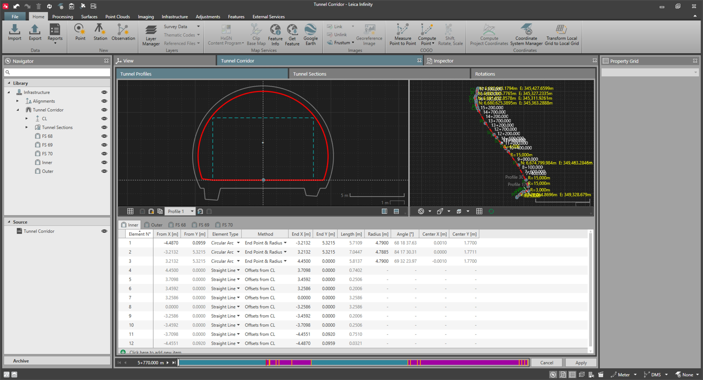

# Overview

### Infrastructure Tool - Tunnels

The infrastructure manager is the dedicated tool to view, create and edit the individual components of a tunnel object.

The infrastructure tool opens when you select a tunnel from the ribbon bar Infrastructure tool. Alternatively, you can select a tunnel from the navigator or the inspector by selecting      Edit from the context menu.

**Edit**

By default, the infrastructure manager opens as a new tab next to the inspector.

|  |  |
| --- | --- |

The chainage bar represents the whole alignment from its start to the end. The vertical lines in the chainage bar show you where profiles are assigned.

You can shift the slider to any position in the alignment or enter a chainage value to make the slider jump.

