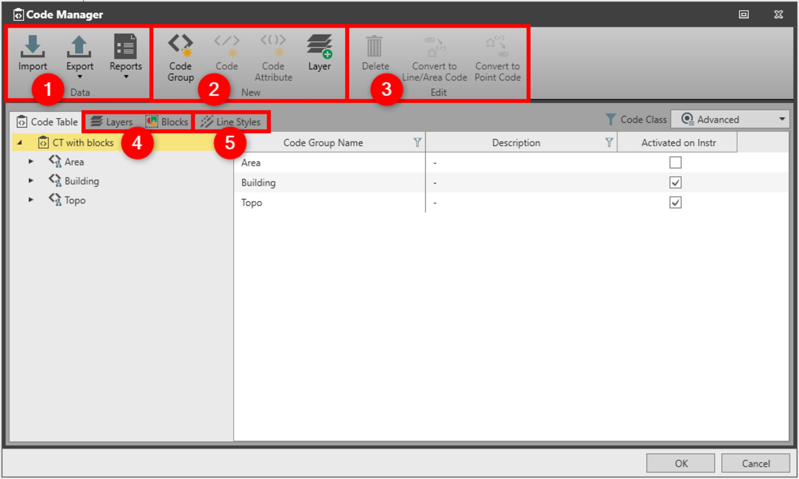

# Overview

### Code Manager

The code manager allows you to manage all feature coding information included in code tables:

**The code manager allows you to manage all feature coding information included in code tables:**

- Coding information (code groups, codes and attributes).
- Coding style information (blocks and layers), which are extended code properties used for visualisation.

To open code manager :

**To open code manager :**

| 1. | Go to File, then select Tools and then Code Tables . |
| --- | --- |
| 2. | Select one or create new and select Edit. |

**File**

**Tools**

**Code Tables**

**Edit**

In code manager you can do the following:

**In code manager you can do the following:**

|  |  |
| --- | --- |

| No. | Group Name | Name | Description |
| --- | --- | --- | --- |
| 1. | Data | Import | Import codes from available format files. |
| Export | Export a codelist to various format files or a code table. |
| Reports | Open either code report or code table report. |
| 2. | New | Code Group | Create a new code group. |
| Code | Create a new code. |
| Code Attribute | Create a new code attribute. |
| Layer | Create a new layer. |
| 3. | Edit | Delete | Delete selected objects. |
| Convert to Line/Area Code | Convert a point code with linework to a line/area. |
| Convert to Point Code | Convert a line/area code to point code with linework. |
| 4. |  | Layers and Blocks | Import layers and blocks from DXF/DWG CAD files. |
| 5. |  | Line Styles | Import custom line styles from LIN files. |

**Data**

**New**

**Edit**

See also:

**See also:**

Code Tables

The video "Leica Infinity - Feature Coding Part 1 - How to create a Code Table & Codelist" https://www.youtube.com/watch?v=9Mf8E0trTXA

**"Leica Infinity - Feature Coding Part 1 - How to create a Code Table & Codelist"**

The video "Leica Infinity - Feature Coding Part 2 - How to use blocks and layers" https://www.youtube.com/watch?v=REYP8JzmaSs

**"Leica Infinity - Feature Coding Part 2 - How to use blocks and layers"**

The video "Leica Infinity - Feature Coding Part 3 - How to use custom line styles" https://www.youtube.com/watch?v=ze9ganVf6AU

**"Leica Infinity - Feature Coding Part 3 - How to use custom line styles"**

The video "Leica Infinity - Feature Coding Part 4 - How to process features and export to CAD" https://www.youtube.com/watch?v=ASLoVHHAYGQ

**"Leica Infinity - Feature Coding Part 4 - How to process features and export to CAD"**

