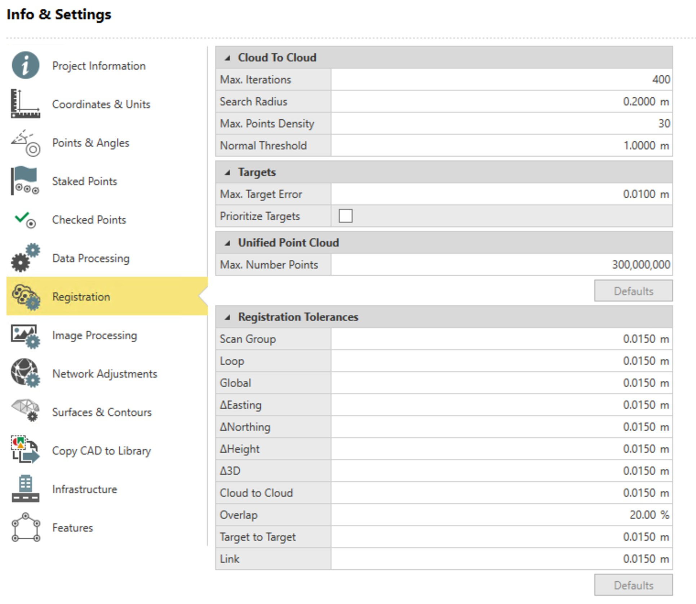

# Point Cloud Registration Settings

### Point Cloud Registration Settings

The point cloud registration settings are configured through the Infinity File > Info & Settings > Registration, the import window and in the register tool itself.

**File**

**Info & Settings**

**Registration**

Registration Settings

**Registration Settings**

The following settings can be configured:

**The following settings can be configured:**

|  |  |
| --- | --- |

Cloud-to-Cloud

**Cloud-to-Cloud**

- **Max. Iterations**: The maximum number of times the algorithm tries to fit the point clouds together.
- **Search Radius**: The radius in which the application searches for common matched surfaces.
- **Max. Point Density**: The number defines how many points in the cloud are used for cloud-to-cloud registration.
- **Normal Threshold**: This value controls the threshold for how valid the surfaces are in the cloud-to-cloud registration.

Targets

**Targets**

- **Max. Target Error**: Maximum allowed error between targets to be included in the registration. This setting also affects the error allowed to match control points to register targets, using apply control points by geometry.
- **Prioritise Targets**: The targets receive a higher weight than the cloud-to-cloud constraint during the link creation process.

Unified Point Cloud

**Unified Point Cloud**

- **Max. Point Number**: The maximum number of points which are created for the unified point cloud.

Registration tolerances

**Registration tolerances**

- **Scan Group**: Overall **Scan Group** error for all links in the **Scan Group**.
- **Loop**: The loop error shows how much the links have to move to be globally optimised. After the scan group optimisation, the loop error is 0.000 as it is contained within the globally optimised error.
- **Global**: The value that the setups have to be moved when included in a loop. A high global error value may indicate a problem with a link or scan group.
- **ΔEasting**: The difference between the Easting coordinate of the control point and the assigned target.
- **ΔNorthing**: The difference between the Northing coordinate of the control point and the assigned target.
- **ΔHeight**: The difference between the height coordinate of the control point and the assigned target.
- **Δ3D**: The difference between 3D coordinates of the control point and the assigned target.
- **Cloud-to-Cloud**: The error in the cloud-to-cloud constraint between the setups.
- **Overlap**: The percentage overlap between the two setups forming the link.
- **Target to Target**: The average distance or error between matching targets in a link or scan group.
- **Link**: The overall error for the link which can be composed of cloud-to-cloud error, target to target error and overlap.

Import Window

**Import Window**

The following settings can be configured in the import window when BLK360 (.blk) files or RTC360 (project.rtc360) files are selected:

**The following settings can be configured in the import window when BLK360 (.blk) files or RTC360 (project.rtc360) files are selected:**

- **Auto Cloud**: The auto cloud routine is performed on the selected setups at import. This process attempts to align the setups and join them together using cloud-to-cloud.
- **Auto Black & White Target**: Black and white targets are extracted at import. The match targets routine then attempts to join setups with matching targets.

Register Tool

**Register Tool**

The following settings can be configured in the links subtab of the register tool tab:

**The following settings can be configured in the links subtab of the register tool tab:**

- **Lock Links**: The lock check box locks the link so that the link does not move during global optimisation. You may choose to lock a link when the global error of the link is too high. Locking the link prevents the link from being affected (moved) by global optimisation.

Property Grid

**Property Grid**

The following setting can be configured in the scan group property grid (error measurements flyout):

**The following setting can be configured in the scan group property grid (error measurements flyout):**

- Lock Links.

The following setting can be configured in the targets property grid:

**The following setting can be configured in the targets property grid:**

- **Target ID**: The **Target ID** can be renamed or matched to an existing target.
- **Assigned Point**: The target can be assigned to an existing Infinity point (for example, TPS or GNSS point).

