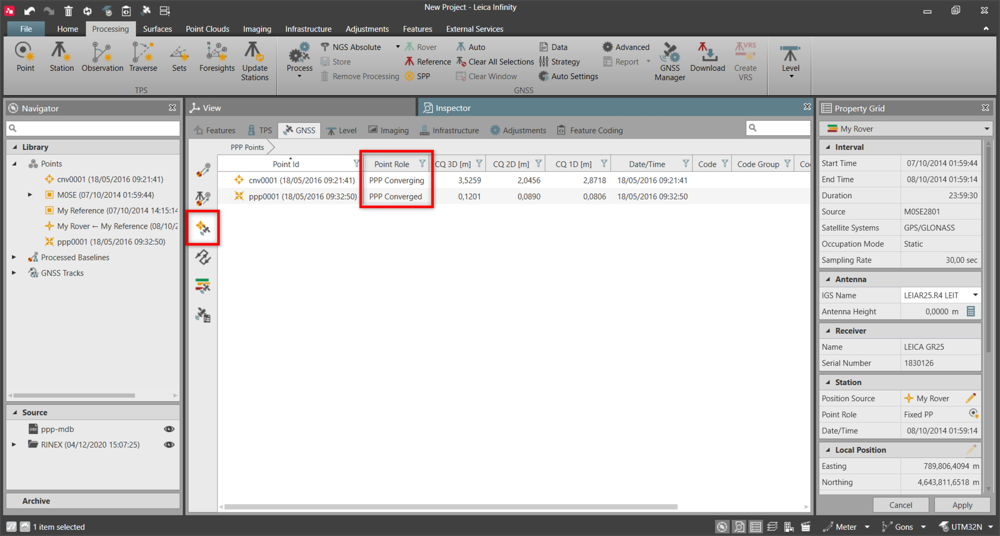

# Point Measured by Precise Point Positioning

### Point Measured by Precise Point Positioning

The Precise Point Positioning (PPP) Points tab lists all the points measured in the field with Captivate, using the PPP technology, based on the Smartlink correction service.

Smartlink is a correction service where GNSS correction data, is transmitted by augmentation satellites (no reference station needed). Measuring a point with this technique, is an alternative to the RTK survey in a situation where a local reference network is not available or not accessible.

Using Smartlink, once the augmentation satellites are tracked, the process takes around 10-30 minutes for the coordinate quality to converge to few centimetres in position.

According to the converging process status, the measured point role can be:

**According to the converging process status, the measured point role can be:**

- PPP Converged (higher quality).
- PPP Converging (lower quality).

|  |  |
| --- | --- |

