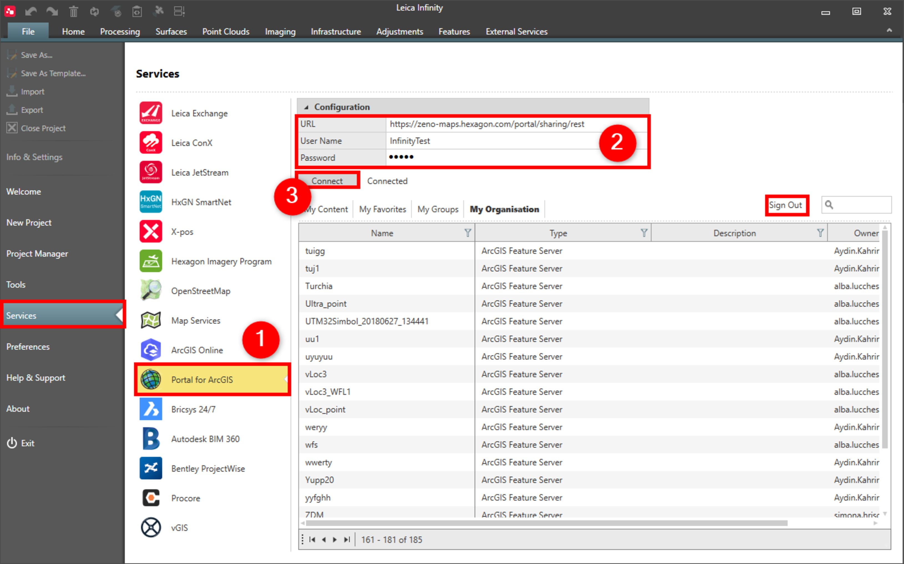

# Portal for ArcGIS

### Portal for ArcGIS

Infinity supports the Portal for ArcGIS, user-defined ArcGIS on premises server.

You can get access to the feature servers to get data.

**Requirements:**

- ArcGIS Online account hosted on the customers own premises.

To connect to the Portal for ArcGIS service:

**To connect to the Portal for ArcGIS service:**

|  |  |
| --- | --- |

| 1. | Select File, then Services and then Portal for ArcGIS from the menu. |
| --- | --- |
| 2. | Enter the URL, User Name and Password. |
| 3. | Select Connect.You are connected until you select to Sign Out. |

**File**

**Services**

**Portal for ArcGIS**

**URL**

**User Name**

**Password**

**Connect**

You are connected until you select to Sign Out.

**Sign Out**

When connected, you can see all supported feature servers grouped as in Portal for ArcGIS: My Content > My Favourites > My Groups > My Organisation.

**My Content**

**My Favourites**

**My Groups**

**My Organisation**

See also:

**See also:**

Get Feature

Save as Portal for ArcGIS Web Map

https://enterprise.arcgis.com/en/portal/10.4/use/what-is-portal-for-arcgis-.htm

