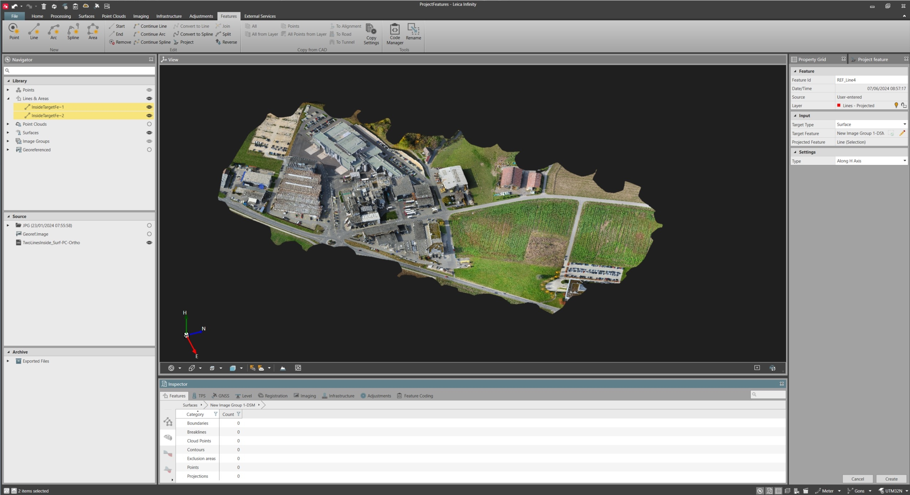
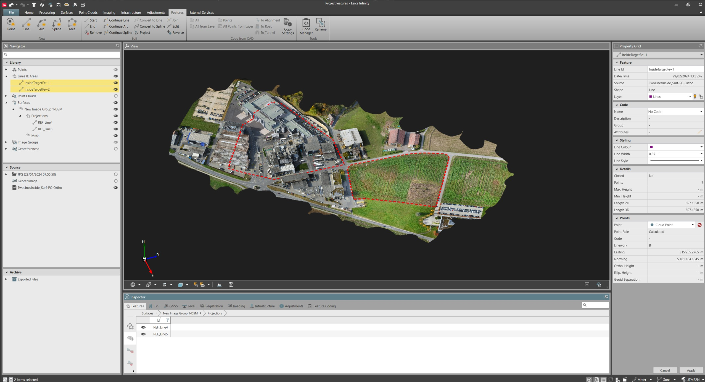
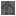
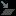

# Project

### Project

The project tool, allows you to project a feature (line or area) on a target object (point cloud, surface, or georeferenced image).

The feature is projected along the height axis, maintaining the XY shape and taking the H coordinate based on the intersection with the target object.

Projected features are added in the project library and the inspector as a child of the target object.

Projected features can be selected and deleted from the project library/inspector and/or from the graphical view.

To project a feature:

**To project a feature:**

|  |  |
| --- | --- |

|  |  |
| --- | --- |

| 1. | In the Inspector, select the    Features tab and select the line/area to be projected. In the Navigator, lines/areas can be selected from the Library section. Alternatively, you can also select lines/areas in the graphical view.It is not possible to send to the register tool, point clouds coming from image processing pipelines or from the multi-station scans.Once sent to the register tool, the point cloud data is listed under available setups. |
| --- | --- |
| 2. | From the Features tab ribbon bar, select    Project to open the project tool in the Property Grid and select the target object. |
| 3. | Select Create. |

**Features**

It is not possible to send to the register tool, point clouds coming from image processing pipelines or from the multi-station scans.

Once sent to the register tool, the point cloud data is listed under available setups.

**Project**

**Create**

