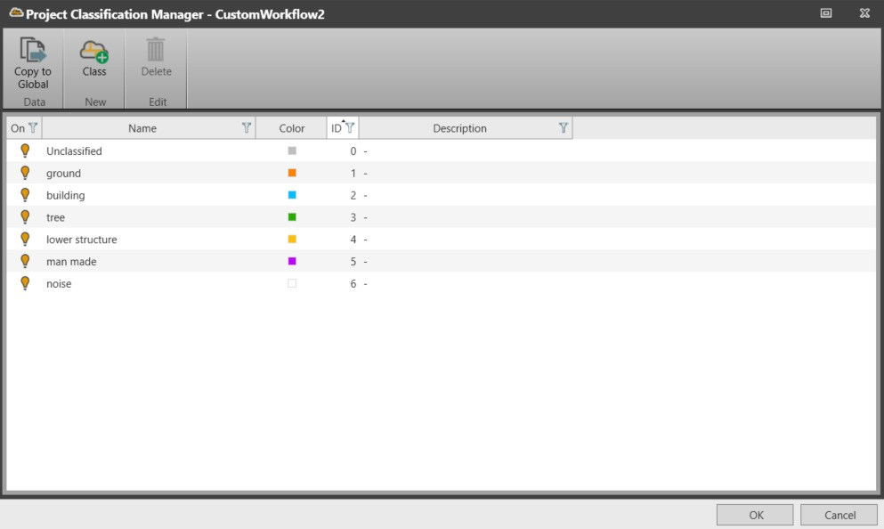

# Project Classification Manager

### Project Classification Manager

The project classification manager, allows you to edit the classification table assigned to the project.

It is possible to change the mapping between class name, class colour and class ID. Classes used in the project can be created or deleted from the classification manager.

Changes done in the project classification table only affect the opened project.

It is possible to copy the changes made to a specific classification table to the global area by selecting    Copy to Global from the project classification table. This overwrites the classification table that was present in the global area.

**Copy to Global**

Classes from the standard classification table “LAS format 1.1 – 1.4” cannot be deleted.

It is possible to turn on/off the visibility for all points belonging to a specific class, using the lightbulb near the class name.

|  |  |
| --- | --- |

