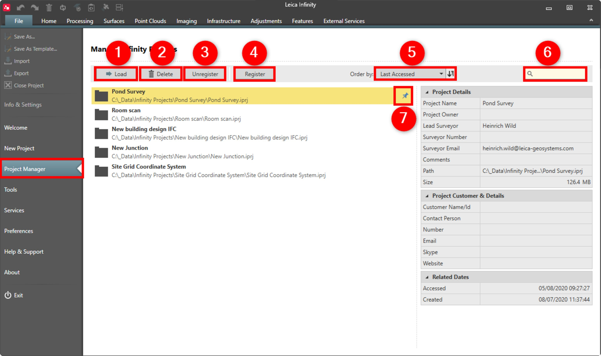

# Project Manager

### Project Manager

The whole data and object management in Infinity is done in working units called projects. Each project uses its own database. The same data and objects may belong to and can be handled in different projects. Start the project manager from the file tab.

In the project manager you can do the following:

**In the project manager you can do the following:**

|  |  |
| --- | --- |

| No. | Name | Description |
| --- | --- | --- |
| 1. | Load | Open an existing project in Infinity so you can carry on working on it. A single click on a project selects it and a double-click loads it. |
| 2. | Delete | Delete the selected project and all the data within it. There is no undo option! |
| 3. | Unregister | Remove an existing project from the project manager list. Does not delete the project. |
| 4. | Register | Browse to an existing Infinity project file (.iprj) to add it to your list of projects. |
| 5. | Order by | The list of Infinity projects can be ordered by:Project name (alphabetical order).Date the project was last used.Date the project was created. |
| 6. | Search box | Search for any part of a project name. |
| 7. | Pin project | Pin the project to have it always available on top of the project list. Pinned projects also appear on the Welcome page. |

**Load**

**Delete**

**Unregister**

**Register**

**Order by**

- Project name (alphabetical order).
- Date the project was last used.
- Date the project was created.

**Search box**

**Pin project**

See also:

**See also:**

Save as Template

