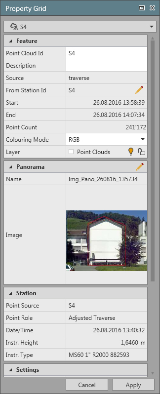

# Property Grid

### Property Grid

The property grid shows the properties of a selected data item. Data items can be selected in the graphical view, in the navigator and in the inspector. By default, the property grid is open and stays open unless you close it. It is filled dynamically depending on the selected data item.

If multiple items are selected, select one from the drop-down list at the top to make its properties be displayed in the property grid.

Functions

**Functions**

|  | All properties are arranged in subgroups that can be collapsed or expanded. |
| --- | --- |
| All properties with a white background can be edited. |
| The    icon and the    icon indicate that these properties can be edited or recalculated in a fly-out or separate tool. Fly-outs have to be confirmed by OK or Cancel before you can continue working. |
| All changes in the properties have to be confirmed by selecting the Apply at the bottom of the property grid. |

**OK**

**Cancel**

**Apply**

If you have closed the property grid window you can make it reappear by selecting the    Properties option in the status bar.

**Properties**

If tilt compensation was applied to a measurement using the Leica AP20 sensor, tilt compensated measurement values are shown in the Property Grid.

