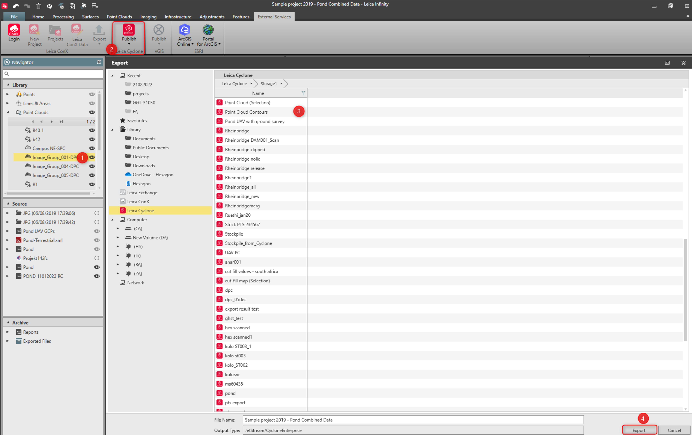

# Publish to Leica Cyclone

### Publish to Leica Cyclone

Infinity supports the Leica JetStream and the Cyclone Enterprise services and allows you to publish point clouds to an existing storage location.

When exporting in .lgs format, point cloud includes:

MSxx/TLS data - Point cloud arrived from instruments and panoramas.

UAV/GS18i data - Dense point cloud and images which were used for point cloud reconstruction.

To publish data:

**To publish data:**

|  |  |
| --- | --- |

| 1. | In the Infinity project, select the point cloud for publication.If no point cloud is selected, all point clouds are exported. |
| --- | --- |
| 2. | Select Publish and then Selection from the External Services tab.Alternatively, select Export and then Selection from the Home tab. |
| 3. | In the Export dialog, select Leica Cyclone in the tree view and go to the required storage location.The JetStream or the Cyclone Storage opens - accordingly to which server was connected to beforehand. |
| 4. | Select Export.The point clouds are stored in the defined storage location on the server.The exported file is written to the Leica Infinity Archive > Exported Files. |

If no point cloud is selected, all point clouds are exported.

**Publish**

**Selection**

**External Services**

Alternatively, select Export and then Selection from the Home tab.

**Export**

**Selection**

**Home**

**Leica Cyclone**

The JetStream or the Cyclone Storage opens - accordingly to which server was connected to beforehand.

**Export**

The point clouds are stored in the defined storage location on the server.

The exported file is written to the Leica Infinity Archive > Exported Files.

**Archive**

**Exported Files**

See also:

**See also:**

Leica Cyclone

https://leica-geosystems.com/products/laser-scanners/software/leica-cyclone/leica-cyclone-enterprise

