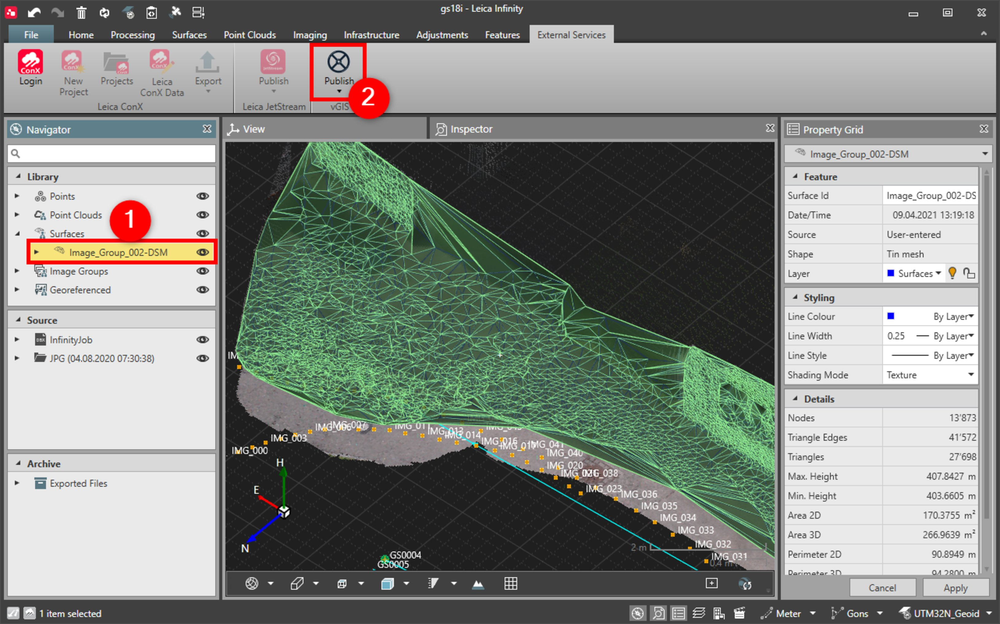

# Publish to vGIS

### Publish to vGIS

Infinity supports the vGIS service and allows you to publish digital surface models in the vGIS augmented reality field application.

**Requirements:**

- Connection to vGIS.
- Project with digital surface model.

To publish data to vGIS:

**To publish data to vGIS:**

|  |  |
| --- | --- |

| 1. | In the Infinity project, select the digital surface model DSM that you want to publish. |
| --- | --- |
| 2. | Select Publish from under vGIS in the External Services tab.Alternatively you can choose Publish all. |

**Publish**

**vGIS**

**External Services**

Alternatively you can choose Publish all.

See also:

**See also:**

vGIS

https://www.vgis.io/

