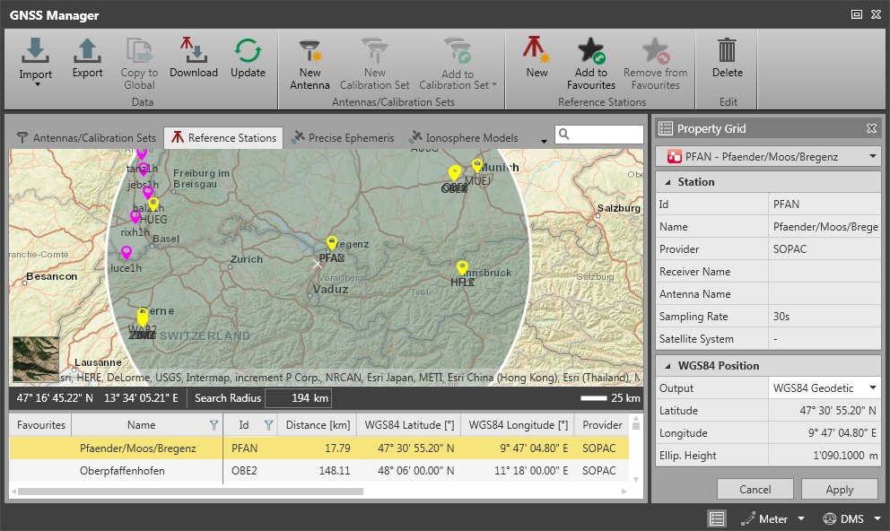
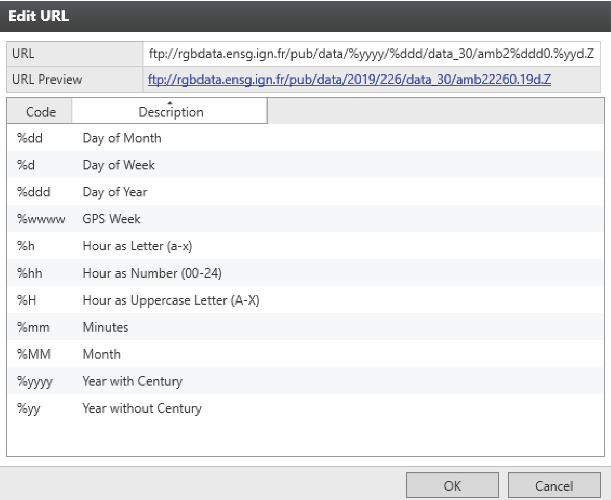

# Reference Stations

### Reference Stations

Download GNSS reference station data

**Download GNSS reference station data**

See also:

**See also:**

The tutorial "How to download reference data" https://leica-geosystems.com/-/media/817c1f0ca2634823b2da45a5359cefec.ashx

**"How to download reference data"**

Tutorial data can be downloaded in the Localisation Tool.

Use the Internet download function to download and import static GNSS data from continuously operating reference stations.

Stations made available by the following providers are found automatically.

- SOPAC:http://garner.ucsd.edu/pub/rinex/
- NGS (NAFTA list of CORS stations):https://geodesy.noaa.gov/corsdata/rinex/
- UNAVCO:https://data.unavco.org/archive/gnss/rinex/obs/
- RGP:ftp://rgpdata.ign.fr/pub/data/
- AGhttps://data.gnss.ga.gov.au/

SmartNet Stations are found when you are logged in to the SmartNet Service.

See also:

**See also:**

HxGN SmartNet

All available stations are shown in a map view:

**All available stations are shown in a map view:**

|  |  |
| --- | --- |

The list is filtered with the radius of the circle:

**The list is filtered with the radius of the circle:**

Click onto the border of the circle and drag it to shrink or enlarge its radius and find more or less stations.

Click into the circle and shift it to find stations in another region.

By default, the circle is located with a radius of 300 km around your project data.

If the project is empty the circle is by default located with a radius of 300 km around Heerbrugg, Switzerland.

If you have selected sites as favourites, the circle is by default located with a radius of 300 km around your favourites.

Download reference station data from the Internet:

**Download reference station data from the Internet:**

| 1. | Select the stations you want to use and select Data > Download in the ribbon bar.Alternatively, right-click onto a station and select Download from the context menu.Next to the Property Grid a Download tab opens up. |
| --- | --- |
| 2. | Enter a specific date and time for which you want to download data.By default, the files suggested for download are within the time frame of your project data.If one or more intervals are selected in the GNSS Inspector, the download takes the date/time based on your selection.Else the date/time is taken based on all available data. |
| 3. | Choose another download directory if you want.By default, the download directory is your download directory or the project folder if available. |
| 4. | Choose whether you want to download Precise Ephemeris and Navigation File simultaneously. |
| 5. | Select the Start option at the bottom of the tab to start the download. |
| 6. | Follow the download progress in the Status section. |
| 7. | In case of errors, check the availability of the files to be downloaded.Availability can comfortably be checked by clicking the hyperlink on the file name. |
| 8. | When download is complete, the data is automatically imported to your project. |

**Data**

**Download**

**Download**

If one or more intervals are selected in the GNSS Inspector, the download takes the date/time based on your selection.

Else the date/time is taken based on all available data.

**Start**

Intervals are automatically merged on import.

See also:

**See also:**

RINEX Import

Precise Ephemeris are added to the list in the Precise Ephemeris tab.

Infinity offers a shortcut to access Internet Download.

You can also select the Download option in the GNSS Processing ribbon bar or select one or more intervals in the GNSS Inspector and choose Download from the context menu. In both cases, the GNSS Manager opens in the Reference Stations tab.

**Download**

**Download**

Update reference stations:

**Update reference stations:**

To update the list of reference stations, select Data > Update in the ribbon bar.

**Data**

**Update**

New reference station:

**New reference station:**

| 1. | To add a new reference station, select Reference Stations > New in the ribbon bar. |
| --- | --- |
| 2. | In the Property Grid enter the Station Info and the WGS84 Position of the station. |
| 3. | To define the Connection, select the Edit option   . |
| 4. | In the Edit URL flyout enter the FTP address.For example: ftp://rgpdata.ensg.ign.fr/pub/data/%yyyy/%ddd/data_30/amb2%ddd0.%yyd.Z with %yyyy being the placeholder for a 4-digit year and %ddd being the placeholder for a day of the year.   The URL preview always refers to the current day of the year, but it is just for illustration to show you that you entered path and file name correctly.When typing the address, beware of case sensitivity. |
| 5. | Confirm the address by selecting OK. |
| 6. | Back in the Property Grid, enter your User Name and Password if necessary to establish a connection. |
| 7. | Select Create to create the new, manually entered reference station. |

**Reference Stations**

**New**

**Edit**

**FTP address**

The URL preview always refers to the current day of the year, but it is just for illustration to show you that you entered path and file name correctly.

When typing the address, beware of case sensitivity.

**OK**

**User Name**

**Password**

**Create**

Add to favourites:

**Add to favourites:**

To mark a selection of reference stations as favourites, select Reference Stations > Add to Favourites in the ribbon bar. In the Inspector view, the stations are marked with an asterisk   .

**Reference Stations**

**Add to Favourites**

Alternatively, right-click on a station and select Add to Favourites from the context menu.

**Add to Favourites**

