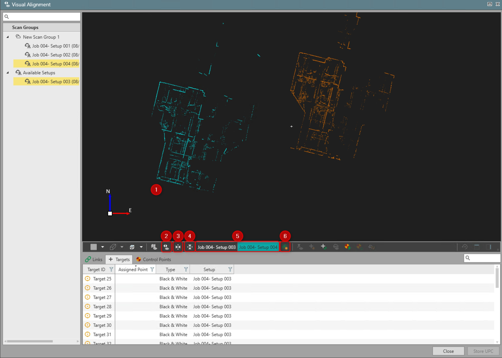

# Registration Using Visual Alignment

### Registration Using Visual Alignment

|  |  |
| --- | --- |

| No. | Name | Description |
| --- | --- | --- |
| 1. | Visual Alignment View | Display two scan setup point clouds which are used in the visual alignment. |
| 2. | Visual Alignment | Open the visual alignment mode. |
| 3. | Top View | Switch the visual alignment graphical view to top view. |
| 4. | Side View | Switch the visual alignment graphical view to side view. |
| 5. | Setup Selector | Switch between two setups opened in visual alignment. Active one can be moved. |
| 6. | Join | Create the link between two setups opened in visual alignment. |

**Visual Alignment View**

**Visual Alignment**

**Top View**

**Side View**

**Setup Selector**

**Join**

The visual alignment view displays two selected setups in different colours to align and join.

The following controls are available in the top view:

**The following controls are available in the top view:**

- **Shift Setup**: Left-click mouse to shift the active setup.
- **Rotate Setup**: Left-click mouse + Shift key to rotate the active setup.

The following controls are available in the front/back/left/right views:

**The following controls are available in the front/back/left/right views:**

- **Shift Setup Along Z-axis**: Left-click mouse on a setup to shift the active setup along the Z-axis.
- **Tilt Setup About View Axis**: Left-click mouse + Shift key to tilt the active setup about the view axis.

The active setup can be toggled by selecting the setup name from the register strip.

Once the setups are visually correct they can be joined:

**Once the setups are visually correct they can be joined:**

- **Join**: Uses the overlapping points between setups to join them together through cloud-to-cloud. A global optimisation is then performed on the scan group. If it detects setups that can also be joined, you are notified and asked to or not to proceed with this additional step.

In the case when between setups, there is not enough overlap to create a valid link and optimise it, the user-defined link is created.

The user-defined link has a lock state as default.

