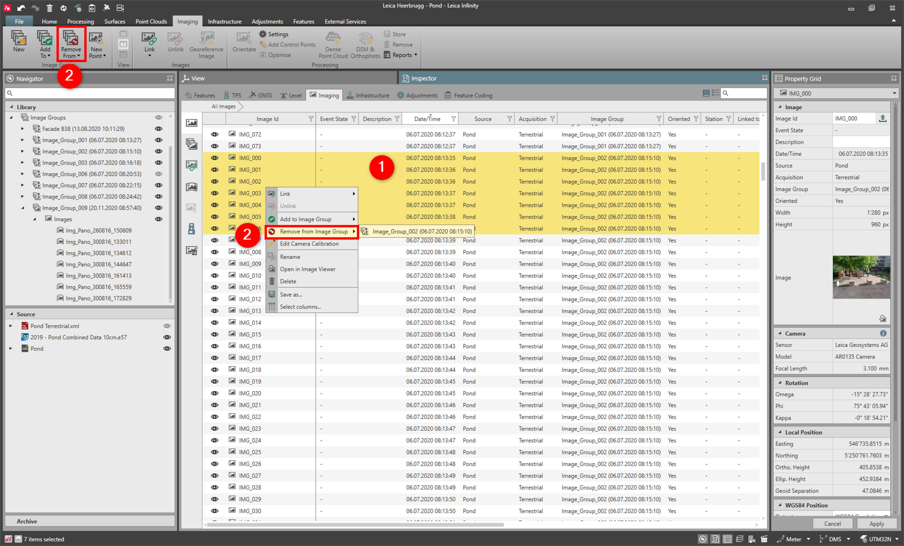

# Remove from Image Group

### Remove from Image Group

To remove images from an image group:

**To remove images from an image group:**

|  |  |
| --- | --- |

| 1. | Select the images to be removed either from the Library or the Inspector or the graphical view. |
| --- | --- |
| 2. | Select Remove from the Imaging tab or from the context menu. |

**Remove**

