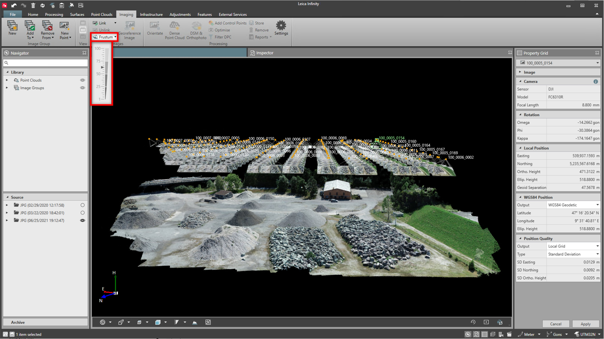

# Resize Frustum

### Resize Frustum

Resize frustum:

**Resize frustum:**

|  |  |
| --- | --- |

The image frustum can be resized using the slider. The default value is 50. Setting the value to 100 makes the frustum bigger, setting the value to 1 makes it smaller.

Changes apply to all images.

