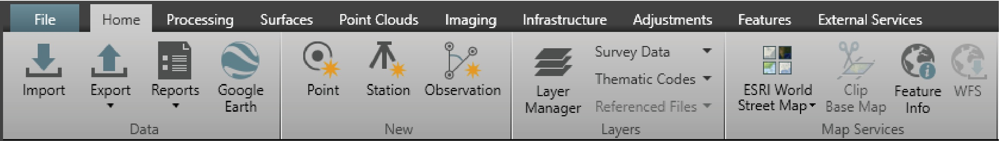

# Ribbon Bar

### Ribbon Bar

The ribbon bar is at the top of the screen and allows access to all the functions and tools.

It is used to group the functions and tools of particular operations together into modules. Each module has its own tab in the main menu at the top. Different tabs allow access to different ribbon bars.

Under the File tab it is possible:

**Under the File tab it is possible:**

- To perform project management-related operations, such as creating and deleting projects.
- To edit all global settings and global objects.

The Home tab is the core of every project, as that is where the Import, Export and Reports functionalities are located.

For more information, refer to Basic Modules.

Under the Processing, Surfaces, Scanning, Imaging, Infrastructure, Adjustments and Features tabs, operations can be run to work with data and perform edits.

Most of these operations are licence protected and must be ordered separately.

For more information, refer to Basic Modules and Optional Modules.

Under the External Services tab, Infinity manages cloud services such as the Leica ConX and the Publish to Leica Cyclone.

