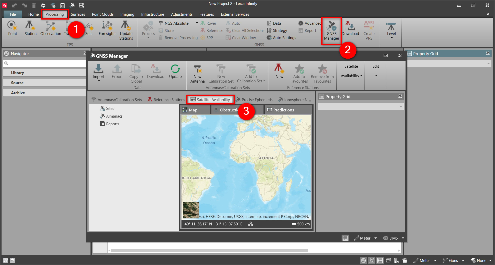
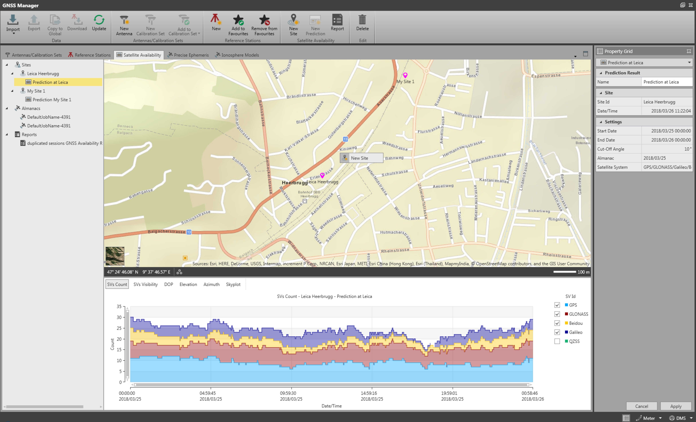
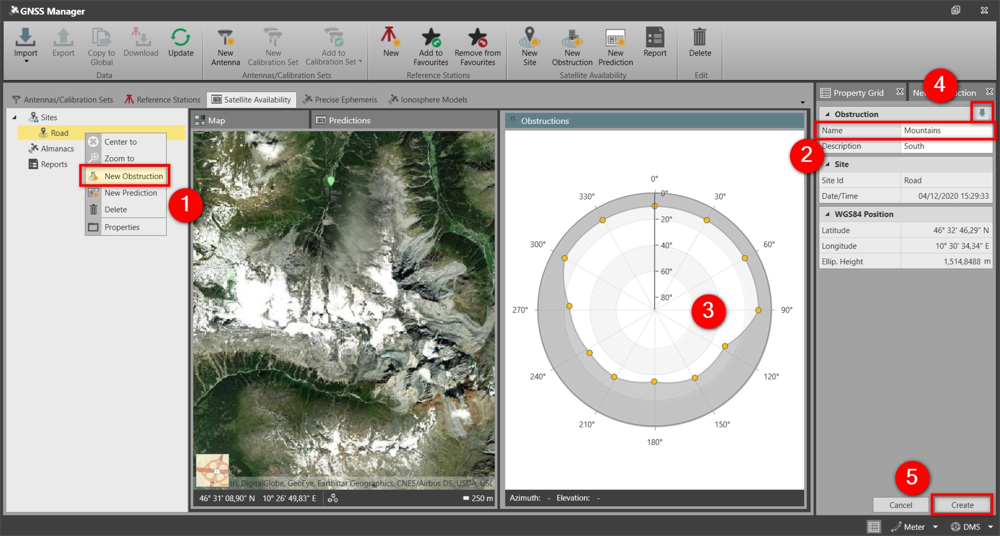
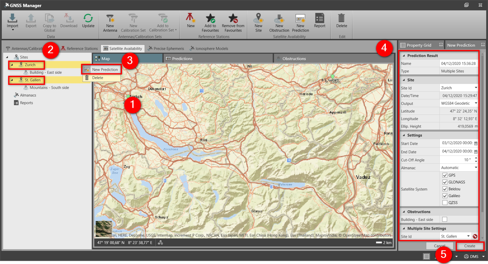

# Satellite Availability

### Satellite Availability

Satellite availability allows you to plan your GNSS field work. It provides you with graphical and numerical information on the satellite constellation for any location (site) at a given time.

You can create site-specific obstructions, to simulate real acquisition conditions to predict the satellites availability for single sites or for a combination of sites. For example, reference and rover receiver at the same time.

To open the satellite availability from inside a project:

**To open the satellite availability from inside a project:**

|  |  |
| --- | --- |

| 1. | Select the Processing tab. |
| --- | --- |
| 2. | Select GNSS Manager from the Processing ribbon bar. |
| 3. | Select the Satellite Availability tab from inside the GNSS Manager. |

**Processing**

**GNSS Manager**

**Satellite Availability**

To predict satellite availability for a site:

**To predict satellite availability for a site:**

|  |  |
| --- | --- |

| 1. | Right-click in the map view where you want to create a site and select New Site from the context menu.The new site Property Grid opens up next to the regular Property Grid. The coordinates are derived from the map.You can also select New Site from the ribbon bar, enter the coordinates in the Property Grid and select Create, to create the site. |
| --- | --- |
| 2. | Give the site a Name and select Create in the Property Grid.The site is added to the map view and to the list of sites in the Navigator. |
| 3. | Select the site and select New Prediction, either from the context menu or from the Satellite Availability tab.The new prediction Property Grid opens up next to the regular Property Grid. |
| 4. | In Settings, select a Start Date and an End Date for the prediction. |
| 5. | In Almanac, select Automatic to automatically download and import an almanac file.You can also import an almanac manually and select it from the drop-down list.Supported almanac file formats are *.mdb, *.yum and *.alm. |
| 6. | In Obstructions, select the obstructions you want to consider in the prediction.Only available, if you have already created obstructions for the specific site. See To create new obstructions for a site:. |
| 7. | Select Create at the bottom of the Property Grid.Details of the new prediction are shown underneath the map view. You get a skyplot plus information on:The satellite vehicles count.The satellite vehicles visibility.The DOP.The elevation values.The azimuths.The skyplot with the obstructions used in the computation. |

**New Site**

The new site Property Grid opens up next to the regular Property Grid. The coordinates are derived from the map.

**New Site**

**Create**

**Create**

The site is added to the map view and to the list of sites in the Navigator.

**New Prediction**

The new prediction Property Grid opens up next to the regular Property Grid.

**Settings**

**Almanac**

**Automatic**

You can also import an almanac manually and select it from the drop-down list.

Supported almanac file formats are *.mdb, *.yum and *.alm.

**Obstructions**

Only available, if you have already created obstructions for the specific site. See To create new obstructions for a site:.

**Create**

- The satellite vehicles count.
- The satellite vehicles visibility.
- The DOP.
- The elevation values.
- The azimuths.
- The skyplot with the obstructions used in the computation.

To create new obstructions for a site:

**To create new obstructions for a site:**

|  |  |
| --- | --- |

| 1. | Select the site, then select New Obstruction, either from the context menu or from the Satellite Availability tab.A new window opens to allow you to draw the obstructions. |
| --- | --- |
| 2. | Enter a Name for the obstruction. |
| 3. | Design your obstructions by drag and drop of the yellow points in the obstructions plot. |
| 4. | As an alternative, you can also import an obstruction file, by selecting Import in the Property Grid. |
| 5. | Select Create at the bottom of the Property Grid.The obstruction is added in the Navigator, under the site. |

**New Obstruction**

A new window opens to allow you to draw the obstructions.

**Import**

**Create**

The obstruction is added in the Navigator, under the site.

Multiple obstructions can be created for a site. Repeat the steps to create new obstructions.

To use one or more obstructions in the prediction computation, enable the related checkbox, as explained in step 6 of To predict satellite availability for a site:.

Predicting satellite availability on multiple sites

**Predicting satellite availability on multiple sites**

To compute the baseline between a reference and a rover receiver, only the common satellites at both sites are considered. In this respect, especially for long baselines, it is useful to have a tool which predicts the satellite availability at multiple sites.

To make a new prediction considering multiple sites:

**To make a new prediction considering multiple sites:**

|  |  |
| --- | --- |

| 1. | Create the sites and the obstructions you want to consider. |
| --- | --- |
| 2. | Highlight all the sites you want to consider in the prediction. |
| 3. | Select New Prediction from the context menu. |
| 4. | In the Property Grid, select the sites where you want to compute the prediction. Go through the settings and obstructions to use for all the sites. |
| 5. | Select Create at the bottom of the Property Grid.The results are added in the Navigator. |

**New Prediction**

**Create**

The results are added in the Navigator.

See also:

**See also:**

The tutorial "How to predict Satellite Availability for a site" https://leica-geosystems.com/-/media/599ca3a5148d41bb8821e3d02d1a674a.ashx

**"How to predict Satellite Availability for a site"**

The tutorial can be downloaded in the Localisation Tool.

