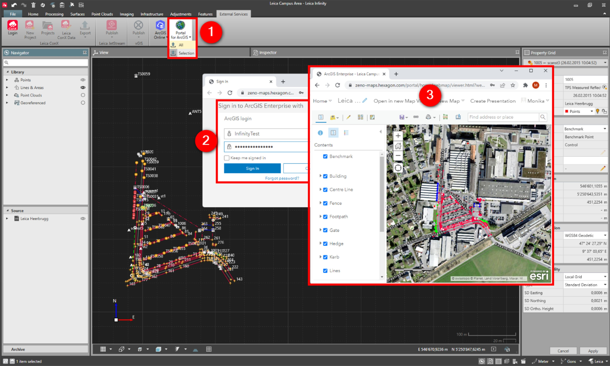

# Save as Portal for ArcGIS Web Map

### Save as Portal for ArcGIS Web Map

With the save as portal for ArcGIS, it is possible to upload Infinity project data to the ArcGIS portal.

Either all library data or selected objects or reference files as .shp or .dxf/dwg can be exported.

**Requirements:**

- Logged in with Portal for ArcGIS.
- Subscription with rights to publish feature.
- Project data must have either WGS84 coordinates or coordinate systems attached.

To save the Infinity project as a new portal for the ArcGIS Web Map:

**To save the Infinity project as a new portal for the ArcGIS Web Map:**

|  |  |
| --- | --- |

| 1. | From within the open project, select the Save as Portal for ArcGIS option. |
| --- | --- |
| 2. | Sign in to your Portal for ArcGIS Online account. |
| 3. | The project data opens as a Portal for ArcGIS Online web map, with objects ordered by the code. |

**Save as Portal for ArcGIS**

A new web map is created, each time the icon is selected.

Created web maps are accessible in Portal for ArcGIS Online/My Content for further edits/sharing.

See also:

**See also:**

Get Feature

Save as an ArcGIS Online Web Map

Map Services

