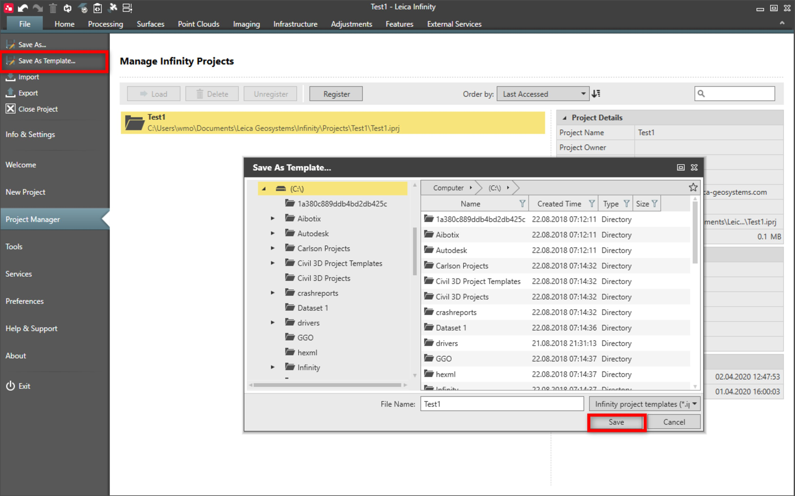
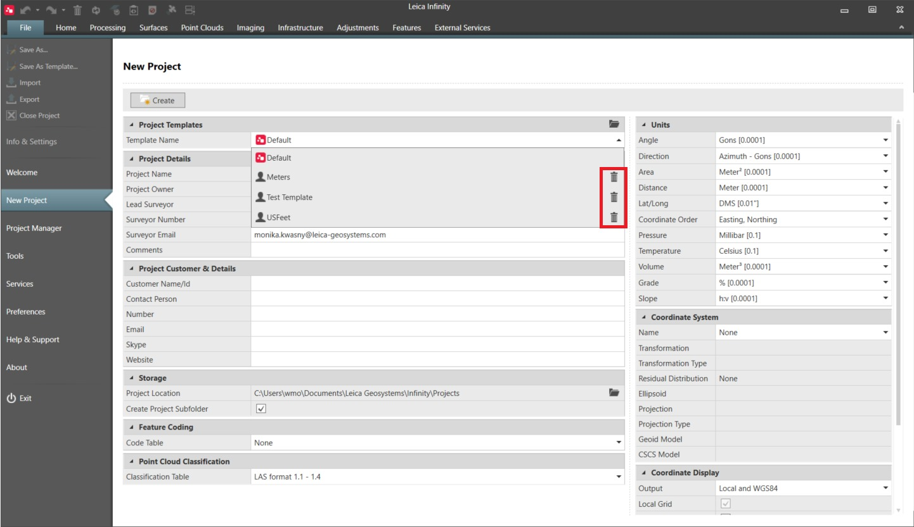

# Save as Template

### Save as Template

Save the current project as a template. When you save a project as a template, all project settings as well any data in the project are saved in the new template file (.iprjt). The new name is added to the template list, to select when creating a new project.

Good practice is to create a project template when having to work with different coordinate systems, project units, code tables and classification tables you commonly use.

The default project template is from the user settings which were set using the Save as Project defaults option in an older version of Infinity.

**Save as Project defaults**

|  |  |
| --- | --- |

Project templates can be deleted from the selection list, when creating a new project.

|  |  |
| --- | --- |

