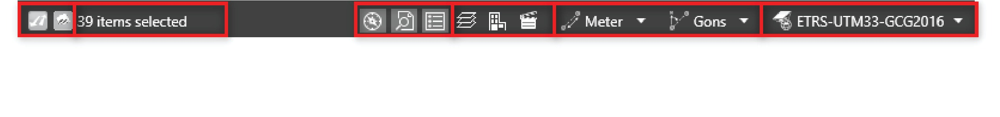
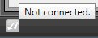
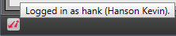
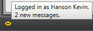

# Status Bar

### Status Bar

The status bar at the bottom of the Infinity workspace, indicates current settings.

Connectivity Status

**Connectivity Status**

You can see information about services that Infinity is connected with (Leica Exchange or Leica ConX).

| Icon | Description |
| --- | --- |
|  | Not logged in.It is not possible to send or receive data using Leica Exchange. You are not notified of incoming messages. |
|  | Indicates being logged in.It is possible to import and export data from the open project. |
|  | New messages are available for download. |

Selection Status

**Selection Status**

The status bar indicates the number of selected items.

Window Status

**Window Status**

The status bar indicates whether the navigator, the inspector and/or the property grid are visible or hidden.

Select the    to open/close them.

Tools

**Tools**

Open the    Layer Manager or the    BIM Explorer or the    Flythrough Creator from here.

**Layer Manager**

**BIM Explorer**

**Flythrough Creator**

Unit Settings

**Unit Settings**

The status bar indicates the units you have chosen for distances and angles.

To change the units and the available decimal places in the current project open the drop-down lists:   .

You can also change the unit settings through File > Info & Settings > Coordinates & Units.

**File**

**Info & Settings**

**Coordinates & Units**

Master Coordinate System Settings

**Master Coordinate System Settings**

The status bar indicates the coordinate system which is currently used for displaying the project data. The selected coordinate system is called the master.

To select another coordinate system open the drop-down list:

You can also select a different master coordinate system through File > Info & Settings > Coordinates & Units.

**File**

**Info & Settings**

**Coordinates & Units**

Conditions:

**Conditions:**

| If you import raw data coming with a coordinate system then this coordinate system is automatically stored to the project and is made available in the drop-down list.To make it be used, select it from the list.If you want a coordinate system from the global coordinate system management to become available for selection, then go to File > Tools > Coordinate Systems and copy the required coordinate system to the current project. |
| --- |
| If you select None then the data of each job is displayed using its own coordinate system.If you export project data to DBX, LandXML or HeXML, always the master coordinate system are exported with your data.If none is used then your data is exported without any coordinate system information.If you want to export all coordinate systems from the current project choose to export coordinate systems in the data export dialog.All coordinate systems are saved to the same TRFSET.DAT file. |

- If you import raw data coming with a coordinate system then this coordinate system is automatically stored to the project and is made available in the drop-down list.To make it be used, select it from the list.

If you want a coordinate system from the global coordinate system management to become available for selection, then go to File > Tools > Coordinate Systems and copy the required coordinate system to the current project.

**File**

**Tools**

**Coordinate Systems**

- If you select **None** then the data of each job is displayed using its own coordinate system.
- If you export project data to DBX, LandXML or HeXML, always the master coordinate system are exported with your data.If none is used then your data is exported without any coordinate system information.

If you want to export all coordinate systems from the current project choose to export coordinate systems in the data export dialog.

All coordinate systems are saved to the same TRFSET.DAT file.

