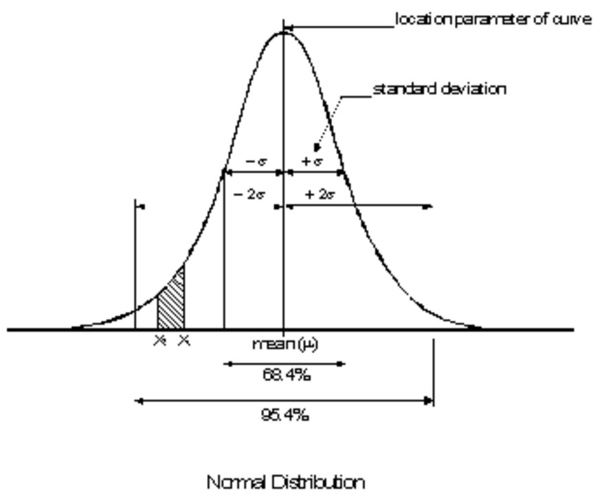
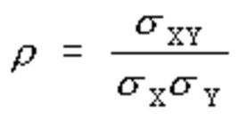
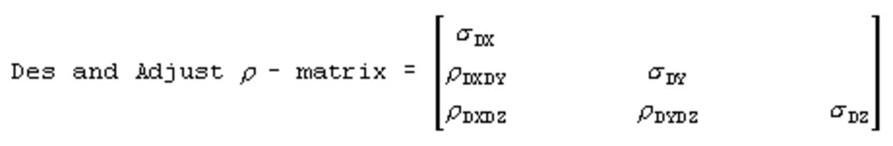

# Stochastic Model

### Stochastic Model

A geodetic observation, such as a direction, distance or height difference, is a random or stochastic variable. A stochastic variable cannot be described by a single and exact value because there is an amount of uncertainty involved in the measurement process. For example, repeatedly measuring the distance between two stations results in a range of different values. This variation is accounted for by a probability distribution. This means that in addition to the mathematical model, it is necessary to formulate a second model which describes the stochastic deviations of the observations; the stochastic model.

For geodetic observations a normal probability distribution is assumed (see the following). The distribution is based on the mean μ and the standard deviation σ.

|  |  |
| --- | --- |

The mean μ represents the value of the mathematical expectation of the observable. The standard deviation is a measure of the dispersion or spread of the probability. The standard deviation characterises the precision of the observation. The square of σ is called the variance. By definition there is a 0.684 probability that normally distributed stochastic variables fall within a window limited by -σ and +σ. For a window limited by -2σ and +2σ this probability is 0.954. In general, the probability that a stochastic variable takes a value between x1 and x2 is equal to the area enclosed by the curve, and the x1 and x2 ordinates. This is the shaded area in the diagram above.

Correlation of observations

**Correlation of observations**

It is possible for two or more observations to be interdependent or correlated. This means that a deviation in one observation influences the other. The correlation between two observations x and y is mathematically expressed by the covariance σxy. The covariance is also used in the correlation coefficient, defined as:

|  |  |
| --- | --- |

The coefficient takes values between minus and plus one:

**The coefficient takes values between minus and plus one:**

-1 ≤ ρ  ≤ 1

If the observations are not interdependent it follows that ρ= 0. The vector elements (DX,DY,DZ) of a GPS baseline are an example for correlated observations. To express this correlation a 3x3 matrix is used. This symmetric matrix is a combination of standard deviations and correlation coefficients:

|  |  |
| --- | --- |

Sigma a priori

**Sigma a priori**

In essence the stochastic model consists of a choice for the probability distribution of the observations. Practically this means that for each observation a standard deviation σ is chosen. The value for s is based on knowledge about the measurement process (conditions in the field, type of instrument) and experience. The standard deviation of most observation is supposed to consist of an absolute part, and a relative part. In the relative part the dependence on the distance between station and target, which characterises the precision of most observations, is accounted for. The standard deviations are entered in the variance-covariance matrix Σb. The precision of the unknowns in the adjustment depends on the precision of the observations given in Σb, and on the propagation of this precision by the mathematical model.

