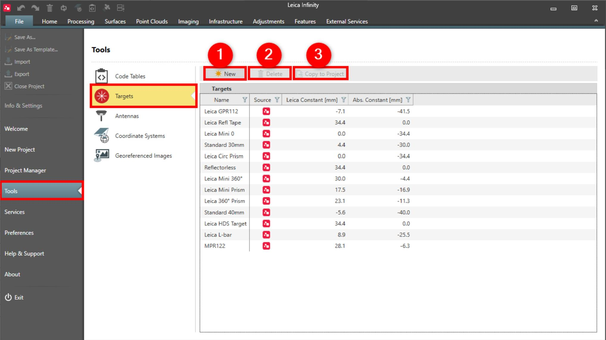

# Targets

### Targets

Prism constants for TPS targets are defined here. Infinity provides a default list of targets.

In targets you can do the following:

**In targets you can do the following:**

|  |  |
| --- | --- |

| No. | Name | Description |
| --- | --- | --- |
| 1. | New | Create a new user-defined target and enter the prism constant values.If a user-defined target was created in the field software, it is imported with the TPS data and therefore is not necessary to be created again. |
| 2. | Delete | Delete selected target. Only user-defined targets can be deleted.There is no undo function. |
| 3. | Copy to Project | Copy user-defined targets to the currently open project. The project must already be open before this option is available. |

**New**

If a user-defined target was created in the field software, it is imported with the TPS data and therefore is not necessary to be created again.

**Delete**

There is no undo function.

**Copy to Project**

See also:

**See also:**

Local and Global Data Objects

