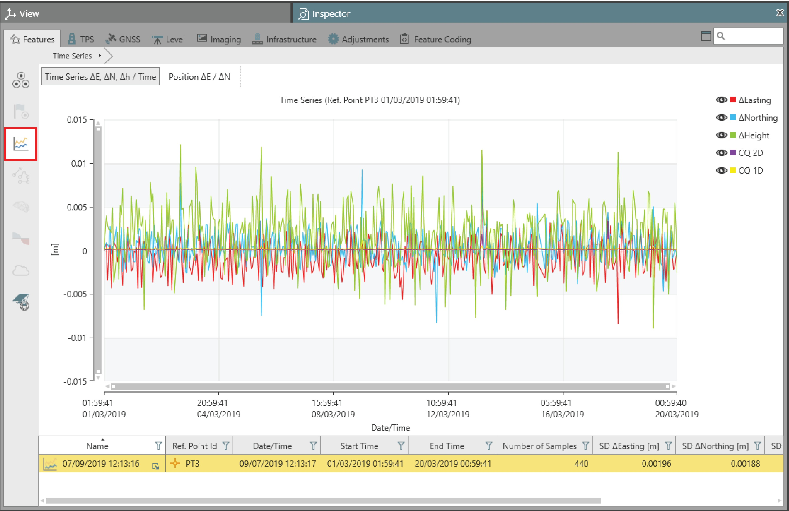
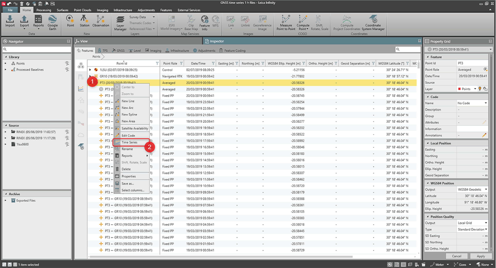
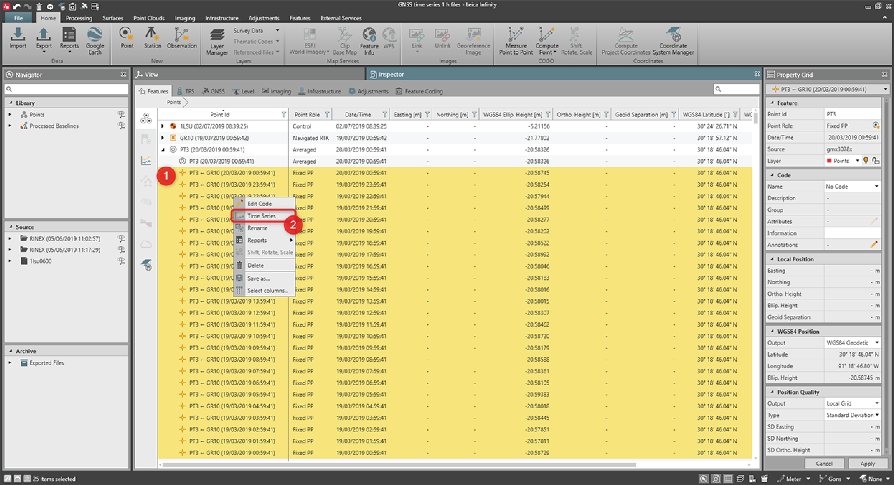
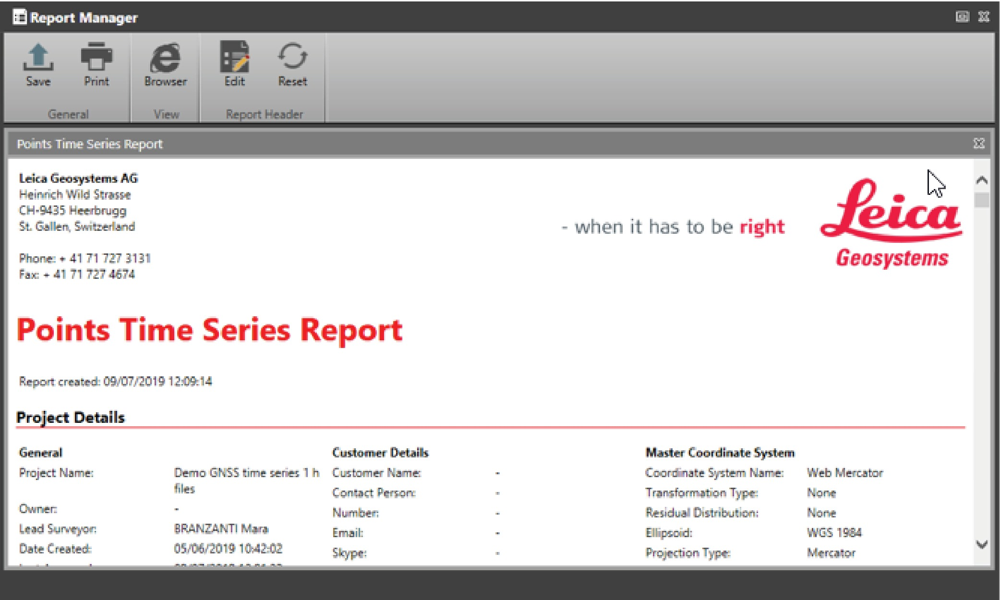
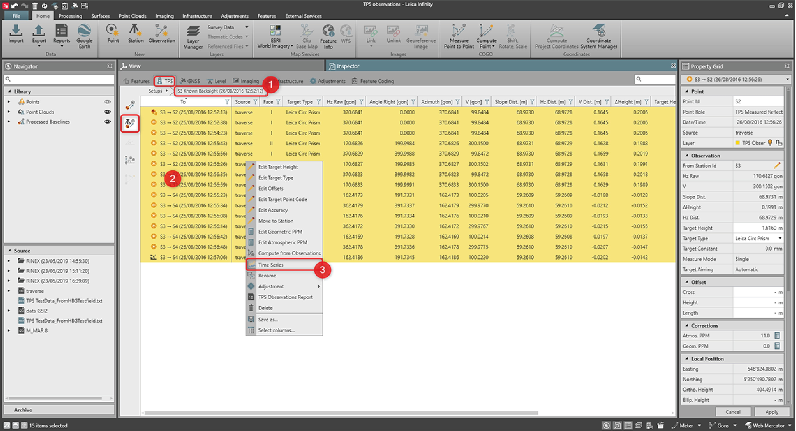
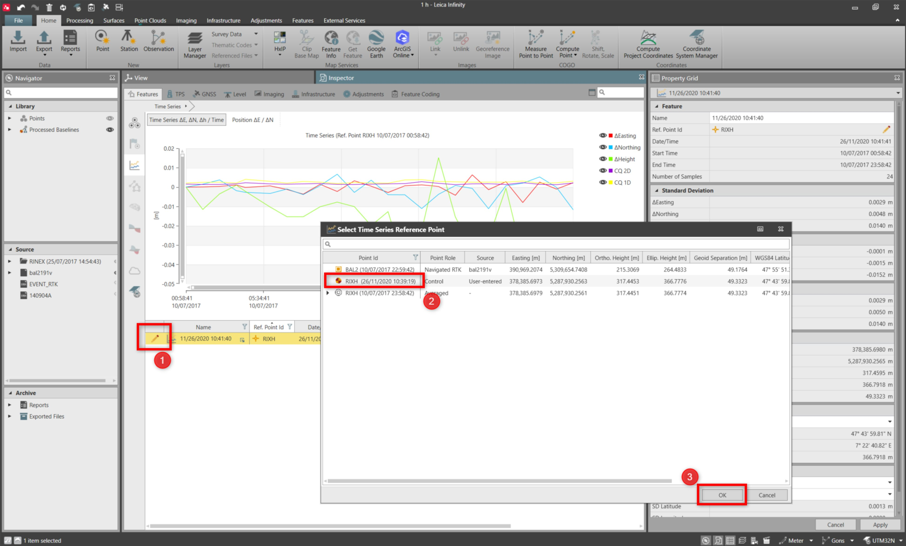

# Time Series

### Time Series

The time series feature, allows you to analyse how coordinates of a point vary over a period, by creating plots over the time.

The plots are created choosing one point as a reference, the highest point role or first measured point in time and computing the differences from that point.

The pre-condition to use the option is the availability of measurements of the same point (same point ID) at different dates and times.

Once the time series plots have been created, it is possible to edit the reference points, see To edit time series reference points:.

The time series results are always available in the application and are accessible from the Inspector > Features > Time Series.

**Inspector**

**Features**

**Time Series**

|  |  |
| --- | --- |

To create a time series plot:

**To create a time series plot:**

From Points

**From Points**

It is possible to create time series for a point measured over a time, independently from how it has been measured (TPS, GNSS, Level).

|  |  |
| --- | --- |

| 1. | In the Inspector, select Features, then Points and then the point to be plotted. |
| --- | --- |
| 2. | Right-click to open the context menu and select Time Series. |

**Inspector**

**Features**

**Points**

**Time Series**

To plot all the points for the highest point role, select only the highest point role. In the example, all the contributors are plotted with the average coordinates of PT3.

To plot a subset of points for the first measured points:

**To plot a subset of points for the first measured points:**

|  |  |
| --- | --- |

| 1. | In the Inspector, select Features, then Points and then the points of interest. |
| --- | --- |
| 2. | Right-click to open the context menu and select Time Series. |

**Inspector**

**Features**

**Points**

**Time Series**

After the process, the Points Time Series Report with the results opens automatically.

|  |  |
| --- | --- |

Results are stored and are always accessible from the Inspector > Features > Time Series.

**Inspector**

**Features**

**Time Series**

From TPS Observations:

**From TPS Observations:**

With TPS measurements, it can be convenient to start the process from TPS observations, to select only the ones coming from the same setup.

In the following picture, the TPS reduced measurement is taken as the reference.

|  |  |
| --- | --- |

| 1. | In the Inspector, select TPS, then TPS Observations by Station Source and then drill into the station source. |
| --- | --- |
| 2. | Select the observations to plot. |
| 3. | Select Time Series from the context menu to create the point time series plot. |

**Inspector**

**TPS**

**TPS Observations by Station Source**

**Time Series**

If all the observations have the same point role, the first measurement is taken as the reference.

If available, the highest post role is taken as the reference.

The Points Time Series Report opens automatically, and the results are always accessible from the Inspector > Features > Time Series.

**Inspector**

**Features**

**Time Series**

From GNSS Observations:

**From GNSS Observations:**

The time series option can also be started from GNSS observations, so that the relative measured points are plotted.

To do that:

**To do that:**

| 1. | In the Inspector, select GNSS, then GNSS Observations by Station Source and drill into station source. |
| --- | --- |
| 2. | Select the observations to plot. |
| 3. | Select Time Series from the context menu to create the point time series plot starting from the selected observations. |

**Inspector**

**GNSS**

**GNSS Observations by Station Source**

**Time Series**

The Points Time Series Report opens automatically, and the results are always available from the Inspector > Features > Time Series.

**Inspector**

**Features**

**Time Series**

To edit time series reference points:

**To edit time series reference points:**

Once time series have been created, it is possible to change the reference points used to compute the residuals, by choosing another existing point in the project. Plots and statistics are automatically updated.

|  |  |
| --- | --- |

| 1. | In the Inspector, select Features, then Time Series and then the Edit Pencil option, to select the results you want to edit. |
| --- | --- |
| 2. | Select a point from the project, that you want to use as a new reference point. |
| 3. | Select OK. |

**Inspector**

**Features**

**Time Series**

**Edit Pencil**

**OK**

