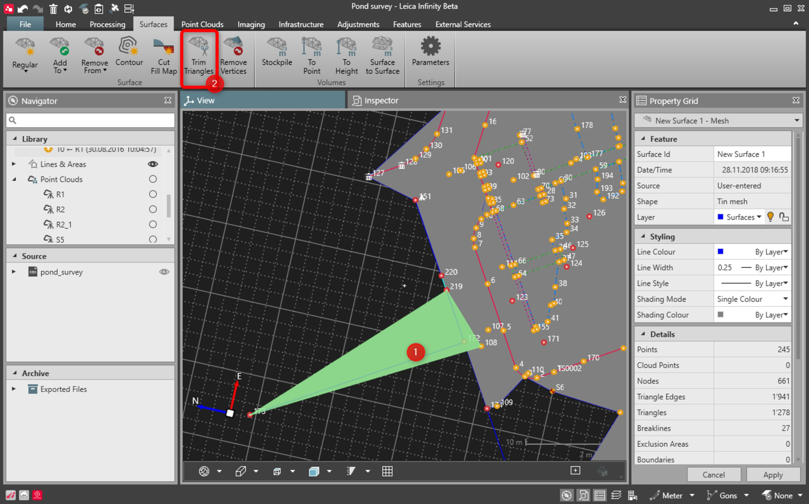

# Trim Triangles

### Trim Triangles

It is possible to remove the triangles at the outer border of a surface.

Removing the triangles does not create holes.

How to trim triangles:

**How to trim triangles:**

|  |  |
| --- | --- |

| 1. | Select at least one triangle at the outer border of a surface.All existing selection shortcuts are available. |
| --- | --- |
| 2. | Select Trim Triangles, either from the ribbon bar or from the context menu. |

All existing selection shortcuts are available.

**Trim Triangles**

See also:

**See also:**

Graphical View

