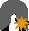
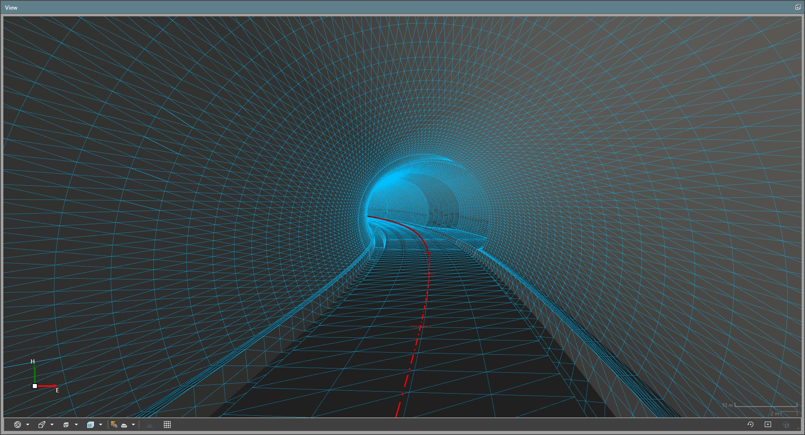

# Tunnel Material Surfaces

### Tunnel Material Surfaces

A tunnel material surface, represents a continuous surface of a tunnel layer. One material surface corresponds to one tunnel layer.

At least one tunnel section is required to create a material surface. This section must have a non-empty tunnel profile for the tunnel layer at its start and end. To create an accurate material surface, profile interpolation is done at a certain interval. See also Max. Profile Interval:.

To interpolate profiles, the number of elements of the two profiles must be the same. Their direction (clockwise or anticlockwise) must also be the same for correct profile interpolation. The material surface can still be successfully generated with a different number of profile elements, provided they are relatively close to each other. Like for example, transitioning tunnel sections.

When creating a material surface, circular arcs in a tunnel profile are approximated with line segments such that the mid-ordinate distance is no greater than 1mm.

To create a tunnel material surface:

**To create a tunnel material surface:**

| 1. | Select a tunnel layer from the Navigator or Inspector. |
| --- | --- |
| 2. | Select    New Material Surface from the Infrastructure ribbon tab or from the context menu. |

**New Material Surface**

Alternatively, select the tunnel and execute the command to create material surfaces for all the tunnel layers within at once. If no errors are encountered, tunnel material surfaces are created.

The size and the complexity of the tunnel material surface can impact project size and performance. See also Max. Profile Interval:. Alternatively, make a reduced size copy of the tunnel first and then create a material surface in the smaller version of the tunnel. See also Copy a Tunnel Object.

|  |  |
| --- | --- |

By editing the tunnel object, the material surface is also updated. Any non-tunnel edits applied to the material surface are lost when the surface is updated due to tunnel edits. Such non-tunnel edits could include trimming triangles, removing vertices, and so on.

