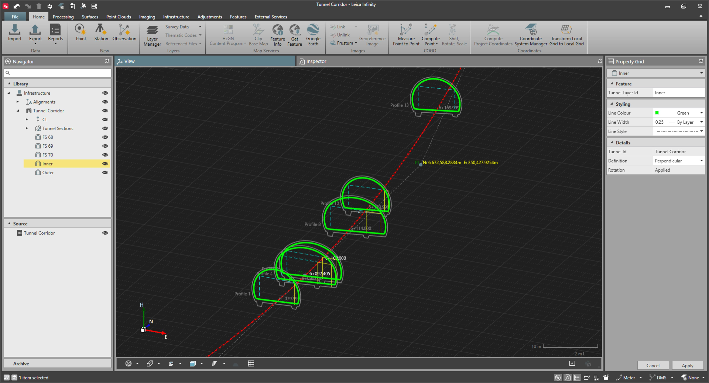

# Tunnel Rotations

### Tunnel Rotations

A tunnel can have superelevations applied on the designs to adapt the vehicle transit on the curves.

In Infinity, the superelevations are stored as a rotation table. Each tunnel can have a list of rotation tables. Each rotation table holds the list of rotations that are applied to the specific chainage. For each rotation table, you can select whether the rotations are applied or not to each of the tunnel layers.

Rotations are by definition applied on the tunnel profiles using the centreline as rotation point. However it is possible to define a vertical and horizontal offset to each rotation point.

Intermediate rotation values and offsets between two assigned rotation chainages are automatically interpolated on board the field software (linear interpolation), while running the tunnel application.

Tunnel layer properties display if the specific layer is rotated or not, with the following information:

|  |  |
| --- | --- |

- None: The tunnel layer has no rotation table associated with it.
- Applied: The tunnel layer has a rotation table associated with it, and it is set to be applied on the tunnel design.
- Not Applied: The tunnel layer has a rotation table associated with it, but it is not set to be applied on the tunnel design.

Rotation tables and their values can be manually created or imported together with the rest of the tunnel design. All the content of the rotation tables and their association to a tunnel layer can be managed within the Tunnel Rotations tab.

