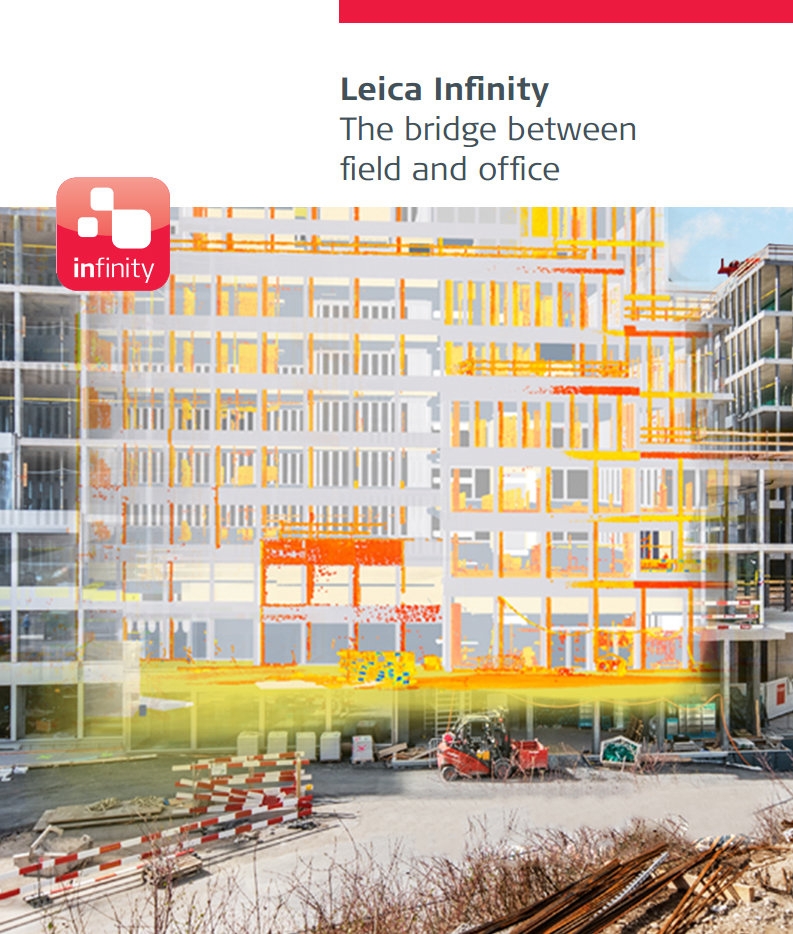

# What is Infinity

### What is Infinity

Infinity, the intuitive office software solution from Leica Geosystems. Infinity is the ideal place for managing data to and from field instruments, the bridge between field and office:

- Bring together different kinds of data on a field project. TPS, GNSS, images, scans and so much more.
- Numerous data formats can be edited, archived and exported to CAD applications easily, without data loss and without the hassles involved in conversion. It is not only for data from different instrument types, but also from multiple sites and survey teams.
- Infinity structures and processes surveying data for simplified, automated and logically expanded workflows, for a faster overview of the project as a whole.

More efficiency, greater transparency, quicker decision making and simply better.

**More efficiency, greater transparency, quicker decision making and simply better.**

The aim of Infinity is to support the user throughout a survey project by fulfilling the following five principles:

**The aim of Infinity is to support the user throughout a survey project by fulfilling the following five principles:**

- **Visualise** - Become familiar with the data and see visually how it is related to each other.
- **Prepare** - Extract and prepare data for the field.
- **Confirm** - Process data, perform quality checks and view results.
- **Report** - Generate and store, proof of quality and completed task reports.
- **Archive** - Know where exported data and reports are stored.

Watch the Infinity overview video which gives you a broad understanding about what modules exist in the software https://www.youtube.com/watch?v=un5WH-sF6I8&list=PL0td7rOVk_IV_al3ziSKuAYA1VVu6W0rM&index=11&t=0s

Some of the features used in the video are licence protected.

To find help, refer to the following:

**To find help, refer to the following:**

- Use the Contents tab to browse to a topic.
- Use the Search tab to search for key words.
- Select a link from a topic to go to the related topics.

|  |  |
| --- | --- |

