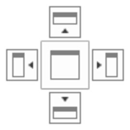

# Window Behaviour

### Window Behaviour

The overall Infinity user interface is designed such that the graphical 2D/3D view is always available in the background. The other three main windows (the navigator, the inspector and the property grid) can individually be made to be:

Floating:

**Floating:**

Select the window with a left mouse-click onto its title bar and drag it out of its place. It is undocked from its place and becomes a floating window.

To dock it again, select the floating window with a left mouse-click onto its title bar and drag it to one of the docking places that appear when you start moving the window. Drop it with the mouse pointer onto the desired docking area and the window is docked in the frame of the opaque yellow area.

Illustration of docking places:

**Illustration of docking places:**

To enlarge the available space for the graphical view, floating windows can comfortably be moved to a second monitor.

Hidden:

**Hidden:**

Hide the window by either selecting    in its title bar or by selecting its option    in the status bar. The option frame disappears to indicate that the window is hidden:

To make the hidden window visible again select the option again in the status bar.

