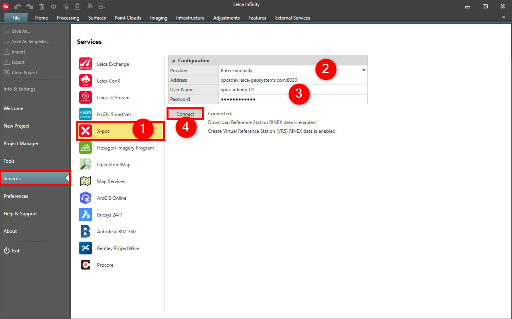
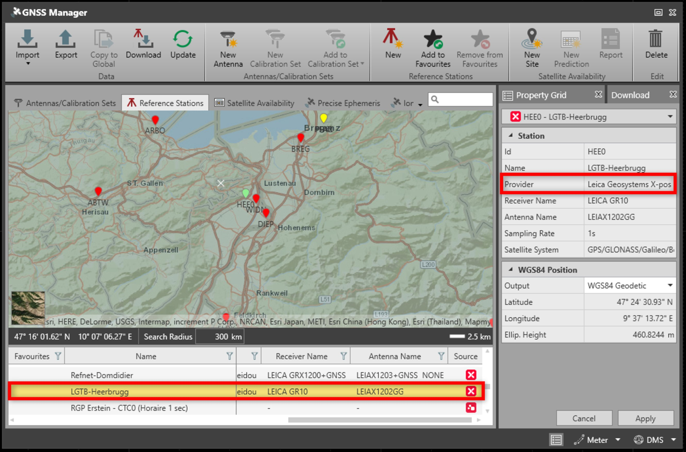

# X-pos

### X-pos

Infinity supports the X-pos service.

The X-pos service allows:

**The X-pos service allows:**

- The download of post-processing data from GNSS reference station service providers directly to a project.
- The creation of Virtual Reference Stations (VRS) directly in a project.

**Requirements:**

- Valid subscription.

To connect to the X-pos service:

**To connect to the X-pos service:**

|  |  |
| --- | --- |

| 1. | Select File, then Services and then X-pos from the menu. |
| --- | --- |
| 2. | Select a Provider in your region from the drop-down menu. The list is updated regularly online.Or select to enter the host manually and type the providers address in the following field.If there is no X-pos service provider listed for your region, contact your local Leica Geosystems sales representative to find out more. |
| 3. | Log in with your User Name and Password.If you do not have a subscription, select the hyperlink to go to the providers webpage. |
| 4. | Select Connect. |

**File**

**Services**

**X-pos**

**Provider**

**User Name**

**Password**

**Connect**

When logged in, you see all X-pos reference stations in the GNSS Manager > Reference Stations tab. X-pos reference stations are indicated with red station icons in the map view and have got X-pos listed as the provider in the Inspector view. Download works in the same way as for all other stations.

**GNSS Manager**

**Reference Stations**

|  |  |
| --- | --- |

With the X-pos licence, you can create VRS from the GNSS ribbon bar by selecting Create VRS after having highlighted a GNSS interval. The VRS is created automatically and imported into the project, starting from the coordinates of the highlighted GNSS interval.

**Create VRS**

See also:

**See also:**

GNSS Manager

Create a Virtual Reference Station (VRS)

The tutorial "How to download reference data" https://leica-geosystems.com/-/media/817c1f0ca2634823b2da45a5359cefec.ashx

**"How to download reference data"**

The tutorial data can be downloaded in the Localisation Tool.

