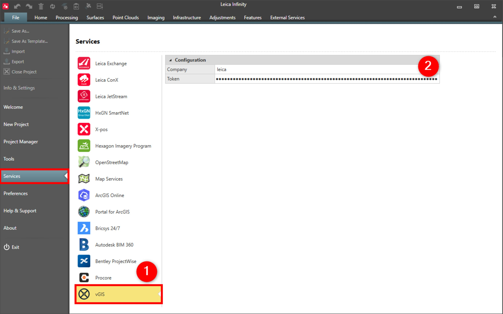

# vGIS

### vGIS

Infinity supports sending data to vGIS. vGIS is a leading extended reality (XR) visualisation platform that transforms traditional BIM, GIS, reality capture and other types of data, into practical augmented reality overlays.

Creating digital surface models from images acquired by UAV or GS18 I, you can share and visualise the models in the vGIS augmented reality field application.

**Requirements:**

- A token provided by vGIS or your customer is required to access the required service location.

To connect to the vGIS service:

**To connect to the vGIS service:**

|  |  |
| --- | --- |

| 1. | Select File, then Services and then vGIS from the menu. |
| --- | --- |
| 2. | Enter the Company, then the Token and then press enter. |

**File**

**Services**

**vGIS**

**Company**

**Token**

See also:

**See also:**

Publish to vGIS

https://www.vgis.io/

